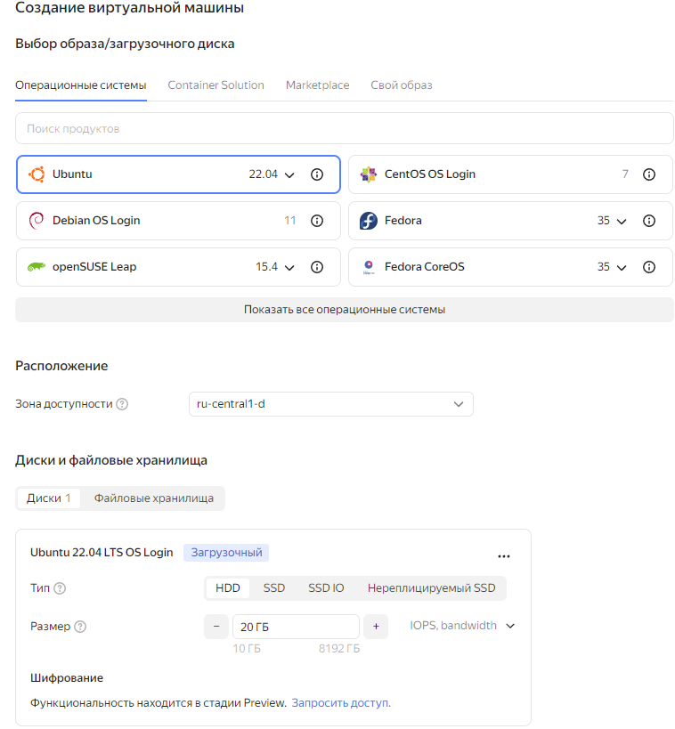
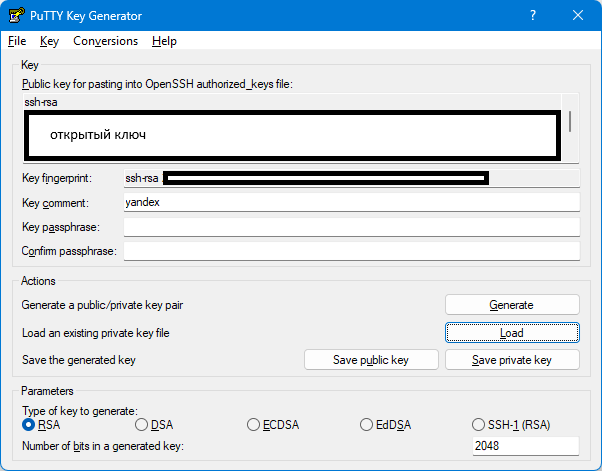
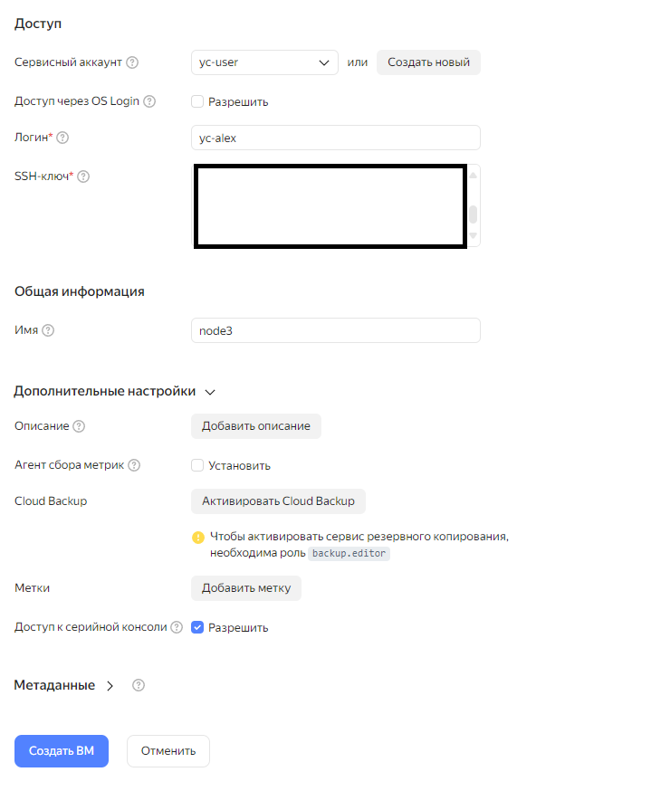
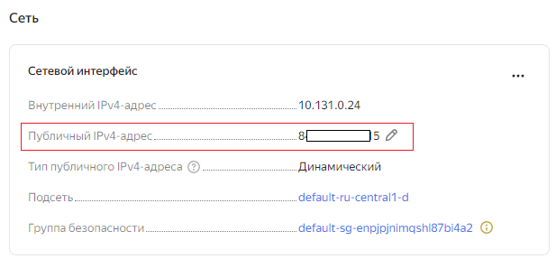
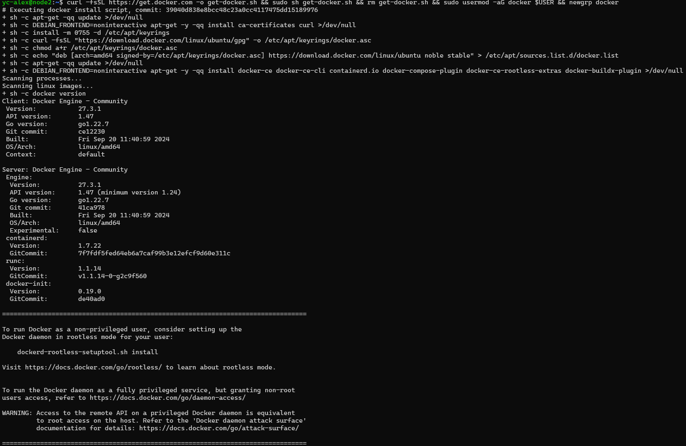
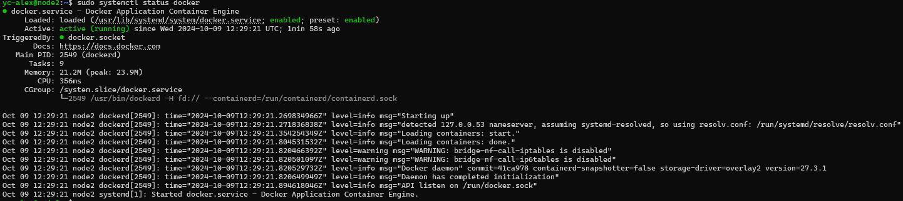
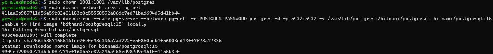
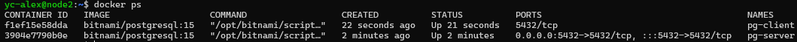
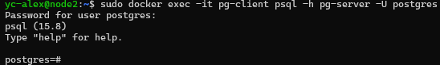
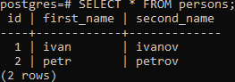

# Домашнее задание
## Установка и настройка PostgteSQL в контейнере Docker

### Цель:
- установить PostgreSQL в Docker контейнере
- настроить контейнер для внешнего подключения

## Описание/Пошаговая инструкция выполнения домашнего задания:
- создать ВМ с Ubuntu 20.04/22.04 или развернуть докер любым удобным способом.\
    Буду создавать виртуальную машину в яндекс облаке с подключением через `SSH`
    - Захожу на консоль ЯО https://console.yandex.cloud/folders/b1g32bcmj4hctvjuvnou/compute/instances
    Создаю виртуальную машину 
    Выбираю параметры 
    SSH ключ создаю в  PuTTYGen нажав кнопку `Generate` создаю ключ. Перехожу в меню `Conversions` вверху, выбераю `Export OpenSSH key`, сохраняю его в каталог D:\Keys\node3_key и назначаю права доступа на своего пользователя.   Открытый ключ копирую и вставляю в параметр `SSH-ключ*` виртуальной машины.
    
    Нажимаю  \
    После создания ВМ в параметрах смотрю публичный IPv4 адрес 

    Для подключения воспользуюсь консолью  `Terminal` и ввожу 
    ```bash
    ssh -i D:\Keys\node3_key yc-alex@89.169.139.248
    ```
- поставить на нем Docker Engine
    * Обновляю пакеты и устанавливаю https://docs.docker.com/engine/install/ubuntu/
    ```bash
    sudo apt update
    curl -fsSL https://get.docker.com -o get-docker.sh && sudo sh get-docker.sh && rm get-docker.sh && sudo usermod -aG docker $USER && newgrp docker
    ```
    
    * Проверяю статус Docker
    ```bash
    sudo systemctl status docker
    ```
   
- сделать каталог /var/lib/postgres
    * Создаю каталог 
    ```bash
    sudo mkdir -p /var/lib/postgres
    ```
- развернуть контейнер с PostgreSQL 15 смонтировав в него /var/lib/postgresql
    * по заданию ставлю образ Bitnami/postgresql  https://hub.docker.com/r/bitnami/postgresql. ПРИМЕЧАНИЕ: Поскольку это некорневой контейнер, смонтированные файлы и каталоги должны иметь соответствующие разрешения для UID 1001
    * на каталог назначаю права как в примечании
        ```bash
        sudo chown 1001:1001 /var/lib/postgres
        ```
        Создаю docker-сеть в которой буду размещать контейнеры: 
        ```bash
        sudo docker network create pg-net
        ```
   * Создаю контейнер с именем pg-server и монтирую в него /var/lib/postgres
    ```bash
    sudo docker run --name pg-server --network pg-net  -e POSTGRES_PASSWORD=postgres -d -p 5432:5432 -v /var/lib/postgres:/bitnami/postgresql bitnami/postgresql:15
    ```
    
- развернуть контейнер с клиентом postgres
    * Создаю контейнер с именем pg-client
        ```bash
        sudo docker run -it --name pg-client --network pg-net -d bitnami/postgresql:15 psql -h pg-server -U postgres
        ```
        * контейнер запустится в интерактивном режиме 
        
- подключится из контейнера с клиентом к контейнеру с сервером и сделать таблицу с парой строк
    * подключаюсь к контейнеру pg-client и запускаю утилиту 'psql'.
    ```bash
    sudo docker exec -it pg-client psql -h pg-server -U postgres
    ```
    * необходимо ввести пароль от пользователя 'postgres'
    
    * Создаю таблицу и добавляю данные
    ```SQL
    CREATE TABLE persons(id serial, first_name text, second_name text);
    INSERT INTO persons(first_name, second_name) VALUES('ivan', 'ivanov');
    INSERT INTO persons(first_name, second_name) VALUES('petr', 'petrov');
    ```
    * Проверяю данные
    ```SQL
    SELECT * FROM persons;
    ```
    

- подключится к контейнеру с сервером с ноутбука/компьютера извне инстансов GCP/ЯО/места установки докера
- удалить контейнер с сервером
- создать его заново
- подключится снова из контейнера с клиентом к контейнеру с сервером
- проверить, что данные остались на месте
- оставляйте в ЛК ДЗ комментарии что и как вы делали и как боролись с проблемами


-------------------------------------------------------------------------------------------------------------

- Установка Yandex.Cloud (CLI) https://cloud.yandex.ru/docs/cli/quickstart
- Выполнить инициализацию Yandex.Cloud (CLI) https://yandex.cloud/ru/docs/cli/cli-ref/managed-yc/init


для этого воспользуемся консолью 

ssh -i D:\Keys\node3_key yc-alex@84.201.147.115
yc compute ssh --name node2 --folder-id b1g32bcmj4hctvjuvnou


- поставить на нем Docker Engine
* Обновляю пакеты и установаю доп ПО
    ```bash
    sudo apt update
    sudo apt install -y apt-transport-https ca-certificates curl software-properties-common mc
    ```
    * Добавляю сертификат и репозиторий
    ```bash
    curl -fsSL https://download.docker.com/linux/ubuntu/gpg | sudo apt-key add -
    sudo add-apt-repository "deb [arch=amd64] https://download.docker.com/linux/ubuntu $(lsb_release -cs) stable"
    ```
    * Обновляю пакеты и устанавливаю Docker
    ```bash
    sudo apt update
    sudo apt install -y docker-ce
    ```
    * Проверяю статус Docker
    ```bash
    sudo systemctl status docker
    ```


    Примечание- потом убрать

- поставить на нем Docker Engine
    * Обновляю пакеты и устанавливаю https://docs.docker.com/engine/install/ubuntu/
    ```bash
    sudo apt update
    curl -fsSL https://get.docker.com -o get-docker.sh && sudo sh get-docker.sh && rm get-docker.sh && sudo usermod -aG docker $USER && newgrp docker

    sudo apt install -y docker.io mc
    ```
- развернуть контейнер с PostgreSQL 15 смонтировав в него /var/lib/postgresql
    * Создаю контейнер с именем pg-server
    ```bash
    sudo docker run --name pg-server -e POSTGRES_PASSWORD=mypgpass -v /var/lib/postgres:/var/lib/postgresql/data -d -p 5432:5432 postgres:15

    sudo docker run --name pg-server -e POSTGRES_PASSWORD=postgres -d -p 5432:5432 -v /var/lib/postgreswsl:/bitnami/postgresql bitnami/postgresql:latest
    ```
Проверить Адрес контейнера

 sudo docker inspect -f '{{range .NetworkSettings.Networks}}{{.IPAddress}}{{end}}' pg-server


sudo docker run --name pg-server -e POSTGRES_PASSWORD=postgres -d -p 5432:5432 -v /var/lib/postgreswsl:/bitnami/postgresql bitnami/postgresql:15


- развернуть контейнер с клиентом postgres
    * Создаю контейнер с именем pg-client
        ```bash
        sudo docker run --name pg-client --network pg-net  -e POSTGRES_PASSWORD=postgres -d bitnami/postgresql:15
        ```
        ```bash создать клиент в интерактивном режиме.
        sudo docker run -it --name pg-client1 --network pg-net -d bitnami/postgresql:15 psql -h pg-server -U postgres
        ```

        ```bash 
        docker run -it --rm --network pg-net -e PGPASSWORD=postgres bitnami/postgresql:15 psql -h pg-server -U postgres
        ```
        ```bash
        docker run -it --rm --network pg-net --link pg-server:server bitnami/postgresql:15 psql -h server -U postgres
        ```
        ```
         sudo docker run -it --name pg-client --network pg-net -d --link pg-server:server bitnami/postgresql:15 psql -h server -U postgres