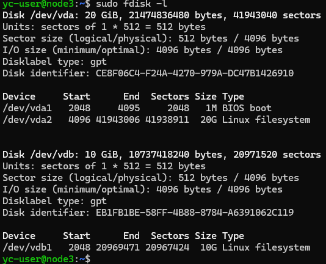

# Домашнее задание
## Установка и настройка PostgreSQL

### Цель:
- создавать дополнительный диск для уже существующей виртуальной машины, размечать его и делать на нем файловую систему
- переносить содержимое базы данных PostgreSQL на дополнительный диск
- переносить содержимое БД PostgreSQL между виртуальными машинами

## Описание/Пошаговая инструкция выполнения домашнего задания:
- создайте виртуальную машину c Ubuntu 20.04/22.04 LTS в GCE/ЯО/Virtual Box/докере
    > Буду создавать виртуальную машину в яндекс облаке с подключением через `SSH`
    - Захожу на консоль ЯО https://console.yandex.cloud/folders/b1g32bcmj4hctvjuvnou/compute/instances
    - Создаю виртуальную машину с параметрами \
     
    - SSH ключ создаю в  PuTTYGen нажав кнопку `Generate` создаю ключ. Перехожу в меню `Conversions` вверху, выбераю `Export OpenSSH key`, сохраняю его в %USERPROFILE%\\.ssh\node3_key. Открытый ключ копирую и вставляю в параметр `SSH-ключ*` виртуальной машины.
    - После создания ВМ в параметрах смотрю публичный IPv4 адрес
    
    - Для подключения воспользуюсь консолью  `Terminal` и ввожу 
        ```bash
        ssh -i .ssh\node3_key yc-user@84.201.146.66
        ```
- поставьте на нее PostgreSQL 15 через sudo apt
    > Обновляю список пакетов, применяю доступные обновления, добавляю официальный репозиторий PostgreSQL для Ubuntu, добавляю GPG-ключ репозитория, снова обновляю список пакетов и устанавливаю PostgreSQL версии 15:
    ```bash   
    sudo apt-get update
    sudo apt upgrade -y -q   
    sudo sh -c 'echo "deb http://apt.postgresql.org/pub/repos/apt $(lsb_release -cs)-pgdg main" > /etc/apt/sources.list.d/pgdg.list'
    wget --quiet -O - https://www.postgresql.org/media/keys/ACCC4CF8.asc | sudo apt-key add -
    sudo apt update
    sudo apt-get install postgresql-15
    ```
    > Все команды можно записать одной строкой используя &&
    ```bash
    sudo apt update && sudo apt upgrade -y -q && sudo sh -c 'echo "deb http://apt.postgresql.org/pub/repos/apt $(lsb_release -cs)-pgdg main" > /etc/apt/sources.list.d/pgdg.list' && wget --quiet -O - https://www.postgresql.org/media/keys/ACCC4CF8.asc | sudo apt-key add - && sudo apt-get update && sudo apt -y install postgresql-15
    ```

- проверьте что кластер запущен через sudo -u postgres pg_lsclusters
    > Результат проверки что кластер запущен 
- зайдите из под пользователя postgres в psql и сделайте произвольную таблицу с произвольным содержимым \
postgres=# create table test(c1 text); \
postgres=# insert into test values('1'); \
\q
    > использую команду
    ```bash 
    sudo -u postgres psql -p 5432
    ```
    > создаю таблицу и добавляю данные
    ```sql
    CREATE TABLE test(c1 text);
    INSERT INTO test VALUES('1');
    ```
    > проверяю записанные данные
    ```sql
    SELECT *FROM test;
    ```
    > Результат:\
    

- остановите postgres например через sudo -u postgres pg_ctlcluster 15 main stop
    > останавливаю кластер и проверяю состояние
    ```bash
    sudo -u postgres pg_ctlcluster 15 main stop
    sudo -u postgres pg_lsclusters
    ```
    
- создайте новый диск к ВМ размером 10GB
    > захожу в консоль ЯО https://console.yandex.cloud/ и добавляю диск к виртуально машине размером 10 ГБ\

    

- добавьте свеже-созданный диск к виртуальной машине - надо зайти в режим ее редактирования и дальше выбрать пункт attach existing disk
    > добавляю созданый диск к ВМ

    
    
- проинициализируйте диск согласно инструкции и подмонтировать файловую систему, только не забывайте менять имя диска на актуальное, в вашем случае это скорее всего будет /dev/sdb https://www.digitalocean.com/community/tutorials/how-to-partition-and-format-storage-devices-in-linux
    > Смотрю список доступных дисков 
    ```bash
    sudo fdisk -l
    ```
    
    > Создаю первичный раздел и файловуюю систему ext4
    ```bash
    sudo parted /dev/vdb mklabel gpt
    sudo parted -a opt /dev/vdb mkpart primary ext4 0% 100%
    sudo mkfs.ext4 /dev/vdb1
    sudo fdisk -l
    ```
    
    > создаю точку монитрования */mnt/data* и монитрую файловую систему 
    ```bash
    sudo mkdir -p /mnt/data
    sudo mount /dev/vdb1 /mnt/data
    ```
    > добавляю запись в *fstab* для автомотического монтирования при перезагрузке
    ```bash 
    echo '/dev/vdb1 /mnt/data ext4 defaults 0 2' | sudo tee -a /etc/fstab
    ```
    > проверяю что раздел примонтированны
    ```bash
    df -h
    ```
    
-  перезагрузите инстанс и убедитесь, что диск остается примонтированным (если не так смотрим в сторону fstab)
    > Перезагружаю ВМ и проверяю примонтирован ли диск
    ```bash
    sudo reboot
     ssh -i .ssh\node3_key yc-user@84.201.146.66
    df -h
    ```
    

- сделайте пользователя postgres владельцем /mnt/data - chown -R postgres:postgres /mnt/data/
    > Выполняю команду sudo chown -R postgres:postgres /mnt/data

- перенесите содержимое /var/lib/postgres/15 в /mnt/data - mv /var/lib/postgresql/15/mnt/data
    > перемещаю содержимое кмандой  
    ```bash
    sudo mv /var/lib/postgresql/15 /mnt/data
    ```

- попытайтесь запустить кластер - sudo -u postgres pg_ctlcluster 15 main start
    > выполняю команду запуска кластера
    ```bash
    sudo -u postgres pg_ctlcluster 15 main start
    ```
- напишите получилось или нет и почему
    > не удалось запустить кластер \
    

- задание: найти конфигурационный параметр в файлах раположенных в /etc/postgresql/15/main который надо поменять и поменяйте его
    > открываю конфигурвционный файл кластера
    ```bash
    sudo nano /etc/postgresql/15/main/postgresql.conf
    ```
- напишите что и почему поменяли
    > меняю значение парамера который указывает где хранятся данные : data_directory = '/mnt/data/15/main' \
    
- попытайтесь запустить кластер - sudo -u postgres pg_ctlcluster 15 main start
    > выполняю команду запуска кластера
    ```bash
    sudo -u postgres pg_ctlcluster 15 main start
    ```
    
- напишите получилось или нет и почему
    > проверяю состояние кластера
    ```bash
    pg_lsclusters
    ```
    > как видим кластер запустился
    

- зайдите через через psql и проверьте содержимое ранее созданной таблицы
    > использую команду для подключения к кластеру
    ```bash 
    sudo -u postgres psql -p 5432
    ```
    > проверяю записанные данные
    ```sql
    SELECT *FROM test;
    ```
    > данные получены\
    
- задание со звездочкой *: не удаляя существующий инстанс ВМ сделайте новый, поставьте на его PostgreSQL, удалите файлы с данными из /var/lib/postgres, перемонтируйте внешний диск который сделали ранее от первой виртуальной машины ко второй и запустите PostgreSQL на второй машине так чтобы он работал с данными на внешнем диске, расскажите как вы это сделали и что в итоге получилось.

    > оставанвливаю кластер на ВМ node3 и отмонтрую диск 
    ```bash
    sudo -u postgres pg_ctlcluster 15 main stop
    sudo umount /dev/vdb1 /mnt/data
    ```
    

    > Создаю новую виртуальную машину в ЯО с именем *node4*. \
    > Отключаю виртуальный диск от *node3* и подключаю диск к *node4* \
    
    

    > подключаюсь к новой ВМ
    ```bash 
    ssh -i .ssh\node4_key yc-user@84.252.133.218
    ```
    > Обновляю список пакетов, применяю доступные обновления, добавляю официальный репозиторий PostgreSQL для Ubuntu, добавляю GPG-ключ репозитория, снова обновляю список пакетов и устанавливаю PostgreSQL версии 15:
    ```bash
    sudo apt update && sudo apt upgrade -y -q && sudo sh -c 'echo "deb http://apt.postgresql.org/pub/repos/apt $(lsb_release -cs)-pgdg main" > /etc/apt/sources.list.d/pgdg.list' && wget --quiet -O - https://www.postgresql.org/media/keys/ACCC4CF8.asc | sudo apt-key add - && sudo apt-get update && sudo apt -y install postgresql-15
    ```
    > оставанвливаю кластер на ВМ node4 и удаляю каталог с данными из /var/lib/postgres
    ```bash
    sudo -u postgres pg_ctlcluster 15 main stop
    sudo rm -rf /var/lib/postgresql/15
    ```
    

    > проверяю доступные диски 
    ```bash
    sudo fdisk -l
    ```
    
    > создаю точку монитрования */mnt/data* и монитрую файловую систему 
    ```bash
    sudo mkdir -p /mnt/data
    sudo mount /dev/vdb1 /mnt/data
    ```
    > проверяю что раздел примонтированны
    ```bash
    df -h
    ```
    

    > открываю в редакторе конфигурационный файл кластера и меняю параметр: data_directory = '/mnt/data/15/main'
    ```bash
    sudo nano /etc/postgresql/15/main/postgresql.conf
    ```
    

    > запускаю кластер и проверяю 
    ```bash
    sudo -u postgres pg_ctlcluster 15 main start
    sudo -u postgres psql
    ```
    ```sql
    SELECT * FROM test;
    ```
    

        
    > Как видим в результате получил данные из таблицы *test*