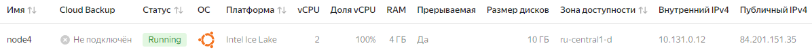

# Домашнее задание
## Настройка autovacuum с учетом особеностей производительности

### Цель:
- запустить нагрузочный тест pgbench
- настроить параметры autovacuum
- проверить работу autovacuum

## Описание/Пошаговая инструкция выполнения домашнего задания:
- Создать инстанс ВМ с 2 ядрами и 4 Гб ОЗУ и SSD 10GB
- Установить на него PostgreSQL 15 с дефолтными настройками
- Создать БД для тестов: выполнить pgbench -i postgres
- Запустить pgbench -c8 -P 6 -T 60 -U postgres postgres
- Применить параметры настройки PostgreSQL из прикрепленного к материалам занятия файла
- Протестировать заново
- Что изменилось и почему?
- Создать таблицу с текстовым полем и заполнить случайными или сгенерированными данным в размере 1млн строк
- Посмотреть размер файла с таблицей
- 5 раз обновить все строчки и добавить к каждой строчке любой символ
- Посмотреть количество мертвых строчек в таблице и когда последний раз приходил автовакуум
- Подождать некоторое время, проверяя, пришел ли автовакуум
- 5 раз обновить все строчки и добавить к каждой строчке любой символ
- Посмотреть размер файла с таблицей
- Отключить Автовакуум на конкретной таблице
- 10 раз обновить все строчки и добавить к каждой строчке любой символ
- Посмотреть размер файла с таблицей
- Объясните полученный результат
- Не забудьте включить автовакуум)
### Задание со *:
- Написать анонимную процедуру, в которой в цикле 10 раз обновятся все строчки в искомой таблице.
Не забыть вывести номер шага цикла.

## Выполнение домашнего задания
> для домашнего задания создал виртуальную машину в ЯО с 2 ядрами и 4 Гб ОЗУ и SSD 10GB\


> подключаюсь к серверу и устанавливаю PostgreSQL 15 с дефолтными настройками
```bash
ssh -i .ssh\yc_key yc-user@84.201.151.35
sudo apt update && sudo apt upgrade -y -q && sudo sh -c 'echo "deb http://apt.postgresql.org/pub/repos/apt $(lsb_release -cs)-pgdg main" > /etc/apt/sources.list.d/pgdg.list' && wget --quiet -O - https://www.postgresql.org/media/keys/ACCC4CF8.asc | sudo apt-key add - && sudo apt-get update && sudo apt -y install postgresql-15
```
> переключаюсь на пользователя postgres, захожу в кластер и создаю базу данных с именем sample 
```bash
sudo su - postgres
psql
```
```sql
CREATE DATABASE sample;
\q
```
> выполняю команду которая создаст таблицы 
```bash
pgbench -i sample
```
> результат
```bash
postgres@node4:~$ pgbench -i sample
dropping old tables...
NOTICE:  table "pgbench_accounts" does not exist, skipping
NOTICE:  table "pgbench_branches" does not exist, skipping
NOTICE:  table "pgbench_history" does not exist, skipping
NOTICE:  table "pgbench_tellers" does not exist, skipping
creating tables...
generating data (client-side)...
100000 of 100000 tuples (100%) done (elapsed 0.07 s, remaining 0.00 s)
vacuuming...
creating primary keys...
done in 0.20 s (drop tables 0.00 s, create tables 0.01 s, client-side generate 0.10 s, vacuum 0.03 s, primary keys 0.06 s).
```
> Запускаю *pgbench* для базы *sample*
```bash
pgbench -c8 -P 6 -T 60 -U postgres postgres
```
> результат:
```bash
postgres@node4:~$ pgbench -c8 -P 6 -T 60 -U postgres sample
pgbench (15.8 (Ubuntu 15.8-1.pgdg24.04+1))
starting vacuum...end.
progress: 6.0 s, 300.5 tps, lat 26.478 ms stddev 27.928, 0 failed
progress: 12.0 s, 428.2 tps, lat 18.710 ms stddev 16.270, 0 failed
progress: 18.0 s, 488.7 tps, lat 16.312 ms stddev 15.690, 0 failed
progress: 24.0 s, 560.0 tps, lat 14.334 ms stddev 13.006, 0 failed
progress: 30.0 s, 687.7 tps, lat 11.627 ms stddev 9.732, 0 failed
progress: 36.0 s, 350.8 tps, lat 22.765 ms stddev 21.095, 0 failed
progress: 42.0 s, 521.0 tps, lat 15.347 ms stddev 13.709, 0 failed
progress: 48.0 s, 557.7 tps, lat 14.376 ms stddev 13.712, 0 failed
progress: 54.0 s, 518.7 tps, lat 15.402 ms stddev 13.396, 0 failed
progress: 60.0 s, 666.3 tps, lat 12.022 ms stddev 9.963, 0 failed
transaction type: <builtin: TPC-B (sort of)>
scaling factor: 1
query mode: simple
number of clients: 8
number of threads: 1
maximum number of tries: 1
duration: 60 s
number of transactions actually processed: 30485
number of failed transactions: 0 (0.000%)
latency average = 15.740 ms
latency stddev = 15.528 ms
initial connection time = 17.119 ms
tps = 508.125711 (without initial connection time)
```
- Применить параметры настройки PostgreSQL из прикрепленного к материалам занятия файла
> Сгенерировал файл с параметрами.  
> захожу в кластер 
```bash
psql
```
> применяю сгенерированные параметры с настройками кластера
```sql
-- Generated by PGConfig 3.1.4 (1fe6d98dedcaad1d0a114617cfd08b4fed1d8a01)
-- https://api.pgconfig.org/v1/tuning/get-config?format=alter_system&include_pgbadger=true&log_format=stderr&max_connections=100&pg_version=15&environment_name=WEB&total_ram=4GB&cpus=2&drive_type=SSD&arch=x86-64&os_type=linux

-- Memory Configuration
ALTER SYSTEM SET shared_buffers TO '1GB';
ALTER SYSTEM SET effective_cache_size TO '3GB';
ALTER SYSTEM SET work_mem TO '10MB';
ALTER SYSTEM SET maintenance_work_mem TO '205MB';

-- Checkpoint Related Configuration
ALTER SYSTEM SET min_wal_size TO '2GB';
ALTER SYSTEM SET max_wal_size TO '3GB';
ALTER SYSTEM SET checkpoint_completion_target TO '0.9';
ALTER SYSTEM SET wal_buffers TO '-1';

-- Network Related Configuration
ALTER SYSTEM SET listen_addresses TO '*';
ALTER SYSTEM SET max_connections TO '100';

-- Storage Configuration
ALTER SYSTEM SET random_page_cost TO '1.1';
ALTER SYSTEM SET effective_io_concurrency TO '200';

-- Worker Processes Configuration
ALTER SYSTEM SET max_worker_processes TO '8';
ALTER SYSTEM SET max_parallel_workers_per_gather TO '2';
ALTER SYSTEM SET max_parallel_workers TO '2';

-- Logging configuration for pgbadger
ALTER SYSTEM SET logging_collector TO 'on';
ALTER SYSTEM SET log_checkpoints TO 'on';
ALTER SYSTEM SET log_connections TO 'on';
ALTER SYSTEM SET log_disconnections TO 'on';
ALTER SYSTEM SET log_lock_waits TO 'on';
ALTER SYSTEM SET log_temp_files TO '0';
ALTER SYSTEM SET lc_messages TO 'C';

-- Adjust the minimum time to collect the data
ALTER SYSTEM SET log_min_duration_statement TO '10s';
ALTER SYSTEM SET log_autovacuum_min_duration TO '0';

-- STDERR Configuration
ALTER SYSTEM SET log_destination TO 'stderr';
ALTER SYSTEM SET log_line_prefix TO '%t [%p]: [%l-1] user=%u,db=%d,app=%a,client=%h ';
```
> выхожу из кластера и перезагружаю его для применения измененений
```sql
\q
```
```bash
pg_ctlcluster 15 main stop
```
> выполнено
```bash
postgres@node4:~$ pg_ctlcluster 15 main restart
Warning: the cluster will not be running as a systemd service. Consider using systemctl:
  sudo systemctl restart postgresql@15-main
```
> тестирую заново *pgbench* для базы *sample*
```bash
pgbench -c8 -P 6 -T 60 -U postgres postgres
```
> результат:
```bash
postgres@node4:~$ pgbench -c8 -P 6 -T 60 -U postgres postgres
pgbench (15.8 (Ubuntu 15.8-1.pgdg24.04+1))
starting vacuum...end.
progress: 6.0 s, 613.7 tps, lat 12.983 ms stddev 11.595, 0 failed
progress: 12.0 s, 600.0 tps, lat 13.325 ms stddev 11.855, 0 failed
progress: 18.0 s, 539.5 tps, lat 14.777 ms stddev 13.953, 0 failed
progress: 24.0 s, 332.5 tps, lat 24.111 ms stddev 20.897, 0 failed
progress: 30.0 s, 611.7 tps, lat 13.074 ms stddev 11.366, 0 failed
progress: 36.0 s, 549.0 tps, lat 14.579 ms stddev 12.819, 0 failed
progress: 42.0 s, 666.3 tps, lat 11.991 ms stddev 9.911, 0 failed
progress: 48.0 s, 622.3 tps, lat 12.853 ms stddev 12.423, 0 failed
progress: 54.0 s, 370.7 tps, lat 21.607 ms stddev 19.458, 0 failed
progress: 60.0 s, 535.7 tps, lat 14.928 ms stddev 13.500, 0 failed
transaction type: <builtin: TPC-B (sort of)>
scaling factor: 1
query mode: simple
number of clients: 8
number of threads: 1
maximum number of tries: 1
duration: 60 s
number of transactions actually processed: 32656
number of failed transactions: 0 (0.000%)
latency average = 14.693 ms
latency stddev = 13.853 ms
initial connection time = 18.005 ms
tps = 544.275983 (without initial connection time)
```
> производительность немного увеличилась от tps = 508.125711 до tps = 544.275983

> подключаюсь к кластеру, создаю таблицу *test_table* с текстовым полем и заполнить сгенерированными данным в размере 1млн строк
```bash
psql
```
```sql
CREATE TABLE test_table (id SERIAL PRIMARY KEY, data TEXT);
INSERT INTO test_table (data) SELECT md5(random()::text) FROM generate_series(1, 1000000);
```
> смотрю тазмер таблицы
```sql
SELECT pg_size_pretty(pg_total_relation_size('test_table'));
```
> результат
```
pg_size_pretty
----------------
 87 MB
(1 row)
```
> 5 раз обновляю строчки все строчки и добавить к каждой строчке символы 'a' 'b' 'c' 'd' 'e'
```sql
UPDATE test_table SET data = data || 'a';
UPDATE test_table SET data = data || 'b';
UPDATE test_table SET data = data || 'c';
UPDATE test_table SET data = data || 'd';
UPDATE test_table SET data = data || 'e';
```
> результат
```sql
postgres=# UPDATE test_table SET data = data || 'a';
UPDATE test_table SET data = data || 'b';
UPDATE test_table SET data = data || 'c';
UPDATE test_table SET data = data || 'd';
UPDATE test_table SET data = data || 'e';
UPDATE 1000000
postgres=# UPDATE test_table SET data = data || 'b';
UPDATE 1000000
postgres=# UPDATE test_table SET data = data || 'c';
UPDATE 1000000
postgres=# UPDATE test_table SET data = data || 'd';
UPDATE 1000000
postgres=# UPDATE test_table SET data = data || 'e';
UPDATE 1000000
```
> смотрю количество мертвых строчек в таблице и когда последний раз приходил автовакуум
```sql
SELECT relname, n_live_tup, n_dead_tup,
trunc(100*n_dead_tup/(n_live_tup+1))::float AS "ratio%", last_autovacuum
FROM pg_stat_user_tables WHERE relname = 'test_table';
```
> результат
```sql
   relname   | n_live_tup | n_dead_tup | ratio% |        last_autovacuum
------------+------------+------------+--------+-------------------------------
 test_table |    1012318 |    1999966 |    197 | 2024-10-12 22:00:35.480734+00
```
> подождал некоторое время, проверяя, пришел ли автовакуум
```sql
  relname   | n_live_tup | n_dead_tup | ratio% |        last_autovacuum
------------+------------+------------+--------+-------------------------------
 test_table |    1005064 |          0 |      0 | 2024-10-12 22:01:30.118473+00
```

> 5 раз обновляю все строчки и добавляя к каждой строчке символ
```sql
UPDATE test_table SET data = data || 'a';
UPDATE test_table SET data = data || 'b';
UPDATE test_table SET data = data || 'c';
UPDATE test_table SET data = data || 'd';
UPDATE test_table SET data = data || 'e';
```

> смотрю размер файла с таблицей
```sql
SELECT pg_size_pretty(pg_total_relation_size('test_table'));
```
> результат
```sql
 pg_size_pretty
----------------
 398 MB
 ```
> отключаю Автовакуум на таблице *test_table*
```sql
ALTER TABLE test_table SET (autovacuum_enabled = false);
```
> 10 раз обновляю все строчки и добавляя к каждой строчке символ. напишем процедуру
DO $$
   DECLARE 
       i INTEGER;
   BEGIN
       FOR i IN 1..10 LOOP
           UPDATE test_table SET data = data || 'a';
           RAISE NOTICE 'Обновление шага: %', i;
       END LOOP;
   END $$;

> смотрю размер файла с таблицей
```sql
SELECT pg_size_pretty(pg_total_relation_size('test_table'));
```
> результат
```sql
 pg_size_pretty
----------------
 959 MB
```
> размер таблицы вырос т.к. обновление строки выполняет процедуру вставки новой строки а старую помечает как мертвую строку. если Автовакуум выключен то строки не освобождаются.
```sql
  relname   | n_live_tup | n_dead_tup | ratio% |        last_autovacuum
------------+------------+------------+--------+-------------------------------
 test_table |     992154 |    9998462 |   1007 | 2024-10-12 22:11:30.494955+00
```
> Включаем автовакуум для таблицы test_table
```sql
ALTER TABLE test_table SET (autovacuum_enabled = true);
```

### Задание со *:
- Написать анонимную процедуру, в которой в цикле 10 раз обновятся все строчки в искомой таблице.
Не забыть вывести номер шага цикла.
> Процедура 10 раз добавляет символ 'a' во все строчки в таблице *test_table* и выводит номер шага
```sql
DO $$
   DECLARE 
       i INTEGER;
   BEGIN
       FOR i IN 1..10 LOOP
           UPDATE test_table SET data = data || 'a';
           RAISE NOTICE 'Обновление шага: %', i;
       END LOOP;
   END $$;
   ```
   > результат
   ```sql
   NOTICE:  Обновление шага: 1
NOTICE:  Обновление шага: 2
NOTICE:  Обновление шага: 3
NOTICE:  Обновление шага: 4
NOTICE:  Обновление шага: 5
NOTICE:  Обновление шага: 6
NOTICE:  Обновление шага: 7
NOTICE:  Обновление шага: 8
NOTICE:  Обновление шага: 9
NOTICE:  Обновление шага: 10
DO
```
