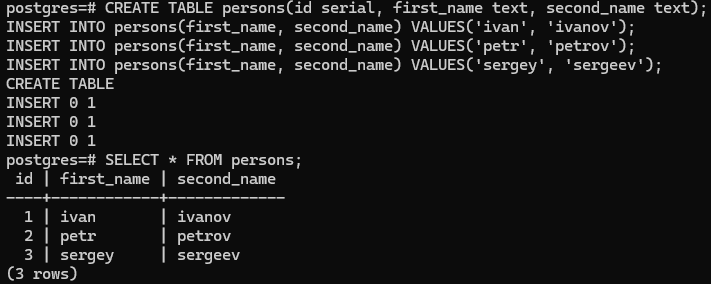

# Домашнее задание
## Работа с журналами

### Цель:
- уметь работать с журналами и контрольными точками
- уметь настраивать параметры журналов

## Описание/Пошаговая инструкция выполнения домашнего задания:
- Настройте выполнение контрольной точки раз в 30 секунд.
- 10 минут c помощью утилиты pgbench подавайте нагрузку.
- Измерьте, какой объем журнальных файлов был сгенерирован за это время. Оцените, какой объем приходится в среднем на одну контрольную точку.
- Проверьте данные статистики: все ли контрольные точки выполнялись точно по расписанию. Почему так произошло?
- Сравните tps в синхронном/асинхронном режиме утилитой pgbench. Объясните полученный результат.
- Создайте новый кластер с включенной контрольной суммой страниц. Создайте таблицу. Вставьте несколько значений. Выключите кластер. Измените пару байт в таблице. Включите кластер и сделайте выборку из таблицы. Что и почему произошло? как проигнорировать ошибку и продолжить работу?

## Выполнение домашнего задания
> для домашнего задания создал виртуальную машину в ЯО с 2 ядрами и 4 Гб ОЗУ и SSD 10GB\


> подключаюсь к ВМ
```bash
ssh -i .ssh\yc_key yc-user@84.201.147.230
```
> устанавливаю PostgreSQL 15 с дефолтными настройками
```bash
sudo apt update && sudo apt upgrade -y -q && sudo sh -c 'echo "deb http://apt.postgresql.org/pub/repos/apt $(lsb_release -cs)-pgdg main" > /etc/apt/sources.list.d/pgdg.list' && wget --quiet -O - https://www.postgresql.org/media/keys/ACCC4CF8.asc | sudo apt-key add - && sudo apt-get update && sudo apt -y install postgresql-15 tree
```
> подключаюсь к кластеру, создаю базу для тестов  с именем *sample*  и устанавливаю расширение *pageinspectи* 
```bash
sudo -u postgres psql
```
```sql
CREATE DATABASE sample;
\c sample
CREATE EXTENSION pageinspect;
```
> меняю настройки *checkpoint_timeout* на 30s
```sql
ALTER SYSTEM SET checkpoint_timeout = '30s';
SELECT pg_reload_conf();
SHOW checkpoint_timeout;
\q
```
> результат
```
postgres=# CREATE DATABASE sample;
CREATE DATABASE
postgres=# \c sample
You are now connected to database "sample" as user "postgres".
sample=# CREATE EXTENSION pageinspect;
CREATE EXTENSION
sample=# ALTER SYSTEM SET checkpoint_timeout = '30s';
ALTER SYSTEM
sample=# SELECT pg_reload_conf();
 pg_reload_conf
----------------
 t
(1 row)

sample=# SHOW checkpoint_timeout;
 checkpoint_timeout
--------------------
 30s
(1 row)

sample=# \q
yc-user@node5:~$
```
> инициализирую базу данных для тестов
```bash
sudo -u postgres pgbench -i sample
```


> переключаюсь на пользователя *postgres*
```bash
sudo su - postgres
```


> запускаю нагрузочный тест c помощью утилиты pgbench на 10 минут. в начале и в конце вызвав функцию pg_wal_current_lsn(): Эта функция возвращает текущую LSN, которая указывает на конец последней записи в журнале записи
```bash
psql -d sample -c "select pg_current_wal_lsn();" && pgbench -c 10 -j 2 -T 600 sample && psql -d sample -c "select pg_current_wal_lsn();"
```
> результат
```bash
postgres@node5:~$ psql -d sample -c "select pg_current_wal_lsn();" && pgbench -c 10 -j 2 -T 600 sample && psql -d sample -c "select pg_current_wal_lsn();"
 pg_current_wal_lsn
--------------------
 0/6CC460E0
(1 row)

pgbench (15.8 (Ubuntu 15.8-1.pgdg24.04+1))
starting vacuum...end.
transaction type: <builtin: TPC-B (sort of)>
scaling factor: 1
query mode: simple
number of clients: 10
number of threads: 2
maximum number of tries: 1
duration: 600 s
number of transactions actually processed: 318147
number of failed transactions: 0 (0.000%)
latency average = 18.860 ms
initial connection time = 16.682 ms
tps = 530.230037 (without initial connection time)
 pg_current_wal_lsn
--------------------
 0/875BF5E0
(1 row)

postgres@node5:~$
```


> смотрю какой объем журнальных данных был сгенерирован за это время
```bash
psql -d sample -c "select '0/875BF5E0'::pg_lsn - '0/6CC460E0'::pg_lsn as bytes;"
```

> вижу что было сгенерированно примерно  425 МБ, т.к. контрольных точек за 10 минут должно быть 20, то на каждую контрольную точку приходится около 21.3 Мб

> поключаюсь к базе и провверяю данные статистики
```bash
psql
```
```sql
SELECT * FROM pg_stat_bgwriter;
```
> результат. выполнились все 20 контрольных точек за 10 минут \


> переключаю режим записи с синхронного режима (по умолчанию) на асинхронный режим
```sql
ALTER SYSTEM SET synchronous_commit = 'off';
SELECT pg_reload_conf();
```
> выхожу из кластера
```sql
\q
```
> запускаю нагрузочный тест c помощью утилиты pgbench на 10 минут
```bash
pgbench -c 10 -j 2 -T 600 sample
```
> результат
```bash
postgres@node5:/home/yc-user$ pgbench -c 10 -j 2 -T 600 sample
pgbench (15.8 (Ubuntu 15.8-1.pgdg24.04+1))
starting vacuum...end.
transaction type: <builtin: TPC-B (sort of)>
scaling factor: 1
query mode: simple
number of clients: 10
number of threads: 2
maximum number of tries: 1
duration: 600 s
number of transactions actually processed: 1902887
number of failed transactions: 0 (0.000%)
latency average = 3.153 ms
initial connection time = 16.326 ms
tps = 3171.490115 (without initial connection time)
```
> Синхронный режим: Более низкий tps = 530.230037, так как каждая транзакция ждет подтверждения записи в журнал.\
Асинхронный режим: Более высокий tps = 3171.490115, так как транзакции не ждут подтверждения записи в журнал.

> Создаю новый кластер с включенной контрольной суммой страниц
```bash
pg_createcluster 15 main2 -- --data-checksums
```


> стартую кластер и подключаюсь к нему
```bash
pg_ctlcluster 15 main2 start
psql -p 5433
```

> создаю таблицу *persons* и вставляю пару строк
```sql
CREATE TABLE persons(id serial, first_name text, second_name text);
INSERT INTO persons(first_name, second_name) VALUES('ivan', 'ivanov');
INSERT INTO persons(first_name, second_name) VALUES('petr', 'petrov');
INSERT INTO persons(first_name, second_name) VALUES('sergey', 'sergeev');
SELECT * FROM persons;
```

> узнаю путь к файлу с таблицей
```sql
SELECT pg_relation_filepath('persons');
```

>выхожу из кластера и выключаю его
```sql
\q
```
```bash
pg_ctlcluster 15 main2 stop
```
> открываю файл таблицы в редакторе и меняю один символ из данных в конце файла
```bash
nano /var/lib/postgresql/15/main2/base/5/16396
```

> чтобы сохранить изменения последоватльно нажимаю Ctrl+o , Enter , Ctrl+x \
> запускаю кластер и подключаюсь к нему
```bash
pg_ctlcluster 15 main2 start
psql -p 5433
```
> делаю выборку из таблицы *persons*
```sql
SELECT * FROM persons;
```

> показало ошибку контрольной суммы \
> пробую игнорировать ошибку и повторить запрос
```sql
SET ignore_checksum_failure TO on;
SELECT * FROM persons;
```

> результат запроса показало с измененными данными, но такое решение не рекомендуетря в продуктивных базах.


