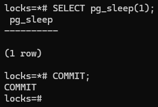
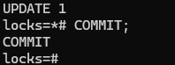

# Домашнее задание
## Механизм блокировок

### Цель:
* понимать как работает механизм блокировок объектов и строк.

## Описание/Пошаговая инструкция выполнения домашнего задания:
* Настройте сервер так, чтобы в журнал сообщений сбрасывалась информация о блокировках, удерживаемых более 200 миллисекунд. Воспроизведите ситуацию, при которой в журнале появятся такие сообщения.
* Смоделируйте ситуацию обновления одной и той же строки тремя командами UPDATE в разных сеансах. Изучите возникшие блокировки в представлении pg_locks и убедитесь, что все они понятны. Пришлите список блокировок и объясните, что значит каждая.
* Воспроизведите взаимоблокировку трех транзакций. Можно ли разобраться в ситуации постфактум, изучая журнал сообщений?
* Могут ли две транзакции, выполняющие единственную команду UPDATE одной и той же таблицы (без where), заблокировать друг друга?

## Задание со звездочкой*
* Попробуйте воспроизвести такую ситуацию.

## Выполнение домашнего задания
> для домашнего задания создал виртуальную машину в ЯО с 2 ядрами и 4 Гб ОЗУ и SSD 10GB\


> подключаюсь к серверу и устанавливаю PostgreSQL 15 с дефолтными настройками
```bash
ssh -i .ssh\yc_key yc-user@84.252.133.128
sudo apt update && sudo apt upgrade -y -q && sudo sh -c 'echo "deb http://apt.postgresql.org/pub/repos/apt $(lsb_release -cs)-pgdg main" > /etc/apt/sources.list.d/pgdg.list' && wget --quiet -O - https://www.postgresql.org/media/keys/ACCC4CF8.asc | sudo apt-key add - && sudo apt-get update && sudo apt -y install postgresql-15 mc
```
1. настраиваю сервер так, чтобы в журнал сообщений сбрасывалась информация о блокировках, удерживаемых более 200 миллисекунд. Для этого меняю параметры конфигурации в файле postgresql.conf: \
log_lock_waits = on \
deadlock_timeout = 200ms 
    ```bash
    sudo nano /etc/postgresql/15/main/postgresql.conf
    ```
    
    
    > чтобы сохранить изменения последоватльно нажимаю Ctrl+o , Enter , Ctrl+x \
    > перезапускаю кластер 
    ```bash
    sudo pg_ctlcluster 15 main restart
    ```
* Сессия 1: подключаюсь к кластеру
  ```bash
  sudo -u postgres psql
  ```
  > создаю базу данных **locks** и подключаюсь к ней
  ```sql
  CREATE DATABASE locks;
  \c locks
  ```
  > создаю таблицу **accounts** и заполняю три сторки значениями
  ```sql
  CREATE TABLE accounts(
    acc_no integer PRIMARY KEY,
    amount numeric
  );
  INSERT INTO accounts VALUES (1,1000.00), (2,2000.00), (3,3000.00);
  ```
  > начинаю транзакцию и обновляю значение **amount** таблицы accounts с **acc_no = 1**
  ```sql
  BEGIN;
  UPDATE accounts SET amount = amount - 100.00 WHERE acc_no = 1;
  ```
  

* Сессия 2: подключаюсь к базе данных **locks** и также обновляю значение **amount** таблицы accounts с **acc_no = 1**
  ```bash
  sudo -u postgres psql -d locks
  ```
  ```sql
  BEGIN;
  UPDATE accounts SET amount = amount + 100.00 WHERE acc_no = 1;
  ```
  
  > Вторая команда UPDATE ожидает блокировку. 
* Сессия 1: Подожду секунду и завершаю первую транзакцию.
  ```sql
  SELECT pg_sleep(1);
  COMMIT;
  ```
  
* Сессия 2: Завершаю вторую транзакцию 
  ```bash
  COMMIT;
  ```
  
* Сессия 3: в новом окне открываю смотрю параметры кластера и просматриваю журнал
  ```bash
  pg_lsclusters
  sudo tail -n 10 /var/log/postgresql/postgresql-15-main.log
  ```
  
  > Вижу запись о блокировке которая была записана после 200ms блокировки транзакции\
  > 2024-10-14 23:52:47.481 UTC [15533] postgres@locks LOG:  process 15533 still waiting for ShareLock on transaction 738 after 200.082 ms

2. Смоделируйте ситуацию обновления одной и той же строки тремя командами UPDATE в разных сеансах. Изучите возникшие блокировки в представлении pg_locks и убедитесь, что все они понятны. Пришлите список блокировок и объясните, что значит каждая. 
    *  Открывваю 3 сессии.\
     В каждой сессии запускаю транзакцию, получаю идентификатор транзакции  **txid_current()** , идентификатор текущего процесса **pg_backend_pid()** и обновляю строку таблицы.
     * Сессия 1
     ```sql
     BEGIN;
     SELECT txid_current(), pg_backend_pid();
     UPDATE accounts SET amount = amount + 100.00 WHERE acc_no = 1;
     ```
     * Сессия 2
     ```sql
     BEGIN;
     SELECT txid_current(), pg_backend_pid();
     UPDATE accounts SET amount = amount + 200.00 WHERE acc_no = 1;
     ```
     * Сессия 3
     ```sql
     BEGIN;
     SELECT txid_current(), pg_backend_pid();
     UPDATE accounts SET amount = amount + 300.00 WHERE acc_no = 1;
     ```
     * Сессия 1 . Смотрю блокировки    
    ```sql
    SELECT locktype, relation::regclass, page, tuple, transactionid, virtualtransaction, pid, mode, granted FROM pg_locks;
    ```
    > Анализирую результат: \
    > locktype = 'tuple': Блокировка на строку. \
    > relation::regclass = 'test_locks': Таблица, на которую установлена блокировка. \
    > page, tuple: Номер страницы и строки в таблице. \
    > transactionid: идентификатор транзакции. \
    > virtualtransaction: Идентификатор виртуальной транзакции. \
    > pid: Идентификатор процесса, установившего блокировку. \
    > mode: Тип блокировки (например, RowExclusiveLock). \
    > granted: true — блокировка установлена, false — ожидается. \
    ```sql
      locktype    |   relation    | page | tuple | transactionid | virtualtransaction | pid  |       mode       | granted
    ---------------+---------------+------+-------+---------------+--------------------+------+------------------+---------
    relation      | accounts_pkey |      |       |               | 6/14               | 1533 | RowExclusiveLock | t
    relation      | accounts      |      |       |               | 6/14               | 1533 | RowExclusiveLock | t
    virtualxid    |               |      |       |               | 6/14               | 1533 | ExclusiveLock    | t
    relation      | accounts_pkey |      |       |               | 3/12               | 1501 | RowExclusiveLock | t
    relation      | accounts      |      |       |               | 3/12               | 1501 | RowExclusiveLock | t
    virtualxid    |               |      |       |               | 3/12               | 1501 | ExclusiveLock    | t
    relation      | accounts_pkey |      |       |               | 4/7                | 1508 | RowExclusiveLock | t
    relation      | accounts      |      |       |               | 4/7                | 1508 | RowExclusiveLock | t
    virtualxid    |               |      |       |               | 4/7                | 1508 | ExclusiveLock    | t
    relation      | pg_locks      |      |       |               | 5/16               | 1512 | AccessShareLock  | t
    virtualxid    |               |      |       |               | 5/16               | 1512 | ExclusiveLock    | t
    transactionid |               |      |       |           743 | 3/12               | 1501 | ExclusiveLock    | t
    transactionid |               |      |       |           745 | 4/7                | 1508 | ExclusiveLock    | t
    transactionid |               |      |       |           744 | 6/14               | 1533 | ExclusiveLock    | t
    tuple         | accounts      |    0 |     5 |               | 4/7                | 1508 | ExclusiveLock    | f
    transactionid |               |      |       |           743 | 6/14               | 1533 | ShareLock        | f
    tuple         | accounts      |    0 |     5 |               | 6/14               | 1533 | ExclusiveLock    | t
    (17 rows)
    ```
    > завершаю транзакции
    * Сессия 1
     ```sql
     COMMIT;
     ```
     * Сессия 2
     ```sql
     COMMIT;
     ```
     * Сессия 3
     ```sql
     COMMIT;
     ```
3. Воспроизведите взаимоблокировку трех транзакций. Можно ли разобраться в ситуации постфактум, изучая журнал сообщений?
  * Буду использовать таблицу **accounts**. Открывваю 3 сессии.\
     В каждой сессии запускаю транзакцию и обновляю строки таблицы c acc_no = 1 и acc_no = 2 , из одной вычитаю значение ко второй прибавляю.\
     Сначала вычитаю из одной:
     * Сессия 1
     ```sql
     BEGIN;
     UPDATE accounts SET amount = amount - 100.00 WHERE acc_no = 1;
     ```
     
     * Сессия 2
     ```sql
     BEGIN;
     UPDATE accounts SET amount = amount - 200.00 WHERE acc_no = 2;
     ```
     
     * Сессия 3
     ```sql
     UPDATE accounts SET amount = amount - 300.00 WHERE acc_no = 1;
     ```
     
     > Теперь прибавляю к другой
     * Сессия 1
     ```sql
     UPDATE accounts SET amount = amount + 100.00 WHERE acc_no = 2;
     ```
     
     * Сессия 2
     ```sql
     UPDATE accounts SET amount = amount + 200.00 WHERE acc_no = 1;
     ```
     
     > произошла взаимоблокировка **deadlock**, и PostgreSQL автоматически откатит транзакцию в сессии 2. \

     > в новом окне просматриваю журнал
      ```bash
      sudo tail -n 20 /var/log/postgresql/postgresql-15-main.log
      ```
      
    Просмотривая журнал можно обнаружить что произошло событие deadlock:  \

    В строке 2024-10-15 21:30:10.851 UTC [1533] postgres@locks ERROR: deadlock detected указано, что был обнаружен deadlock (взаимная блокировка).

    Процесс 1533 ожидает ExclusiveLock на кортеж (0,9) отношения 16389 базы данных 16388, который заблокирован процессом 1508.

    Процесс 1508 ожидает ShareLock на транзакцию 746, который заблокирован процессом 1501.

    Процесс 1501 ожидает ShareLock на транзакцию 747, который заблокирован процессом 1533.

    Это создает циклическую зависимость, которая приводит к deadlock.

    Операции, вызвавшие deadlock:

    Процесс 1533: UPDATE accounts SET amount = amount + 200.00 WHERE acc_no = 1;

    Процесс 1508: UPDATE accounts SET amount = amount - 300.00 WHERE acc_no = 1;

    Процесс 1501: UPDATE accounts SET amount = amount + 100.00 WHERE acc_no = 2;

4. Могут ли две транзакции, выполняющие единственную команду UPDATE одной и той же таблицы (без where), заблокировать друг друга?
  * Да, хотя такая ситуация маловероятна, она все же может возникнуть если порядок, в котором команда обновляет строки, не соответствует порядку, в котором это делает другая команда, может возникнуть взаимоблокировка. Это может привести к deadlock, особенно если транзакции выполняются параллельно и блокируют друг друга.


