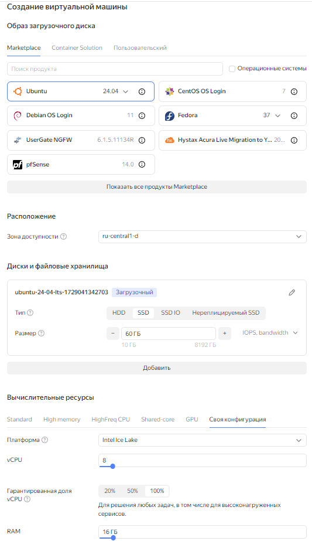
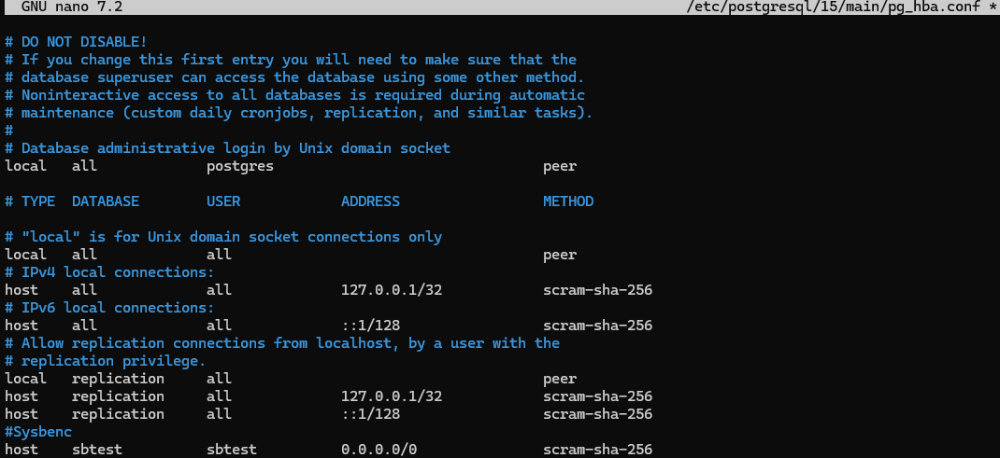
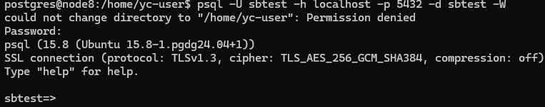
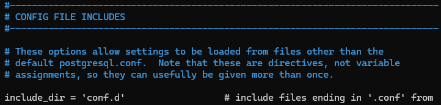

# Домашнее задание
## Нагрузочное тестирование и тюнинг PostgreSQL

### Цель:
* сделать нагрузочное тестирование PostgreSQL
* настроить параметры PostgreSQL для достижения максимальной производительности

## Описание/Пошаговая инструкция выполнения домашнего задания:
* развернуть виртуальную машину любым удобным способом
* поставить на неё PostgreSQL 15 любым способом
* настроить кластер PostgreSQL 15 на максимальную производительность не обращая внимание на возможные проблемы с надежностью в случае аварийной перезагрузки виртуальной машины
* нагрузить кластер через утилиту через утилиту pgbench (https://postgrespro.ru/docs/postgrespro/14/pgbench)
* написать какого значения tps удалось достичь, показать какие параметры в какие значения устанавливали и почему

*  Задание со *: аналогично протестировать через утилиту https://github.com/Percona-Lab/sysbench-tpcc (требует установки https://github.com/akopytov/sysbench)


## Выполнение домашнего задания

* Захожу в консоль управления ЯО https://console.yandex.cloud/folders/b1g32bcmj4hctvjuvnou/compute/instances \
>для домашнего задания создал виртуальную машину в ЯО с 8 ядрами и 16 Гб ОЗУ и SSD 60GB\




> подключаюсь к серверу
```bash
ssh -i .ssh\yc_key yc-user@84.201.181.155
```
* устанавливаю PostgreSQL 15 с дефолтными настройками
```bash
sudo apt update && sudo apt upgrade -y -q && sudo sh -c 'echo "deb http://apt.postgresql.org/pub/repos/apt $(lsb_release -cs)-pgdg main" > /etc/apt/sources.list.d/pgdg.list' && wget --quiet -O - https://www.postgresql.org/media/keys/ACCC4CF8.asc | sudo apt-key add - && sudo apt-get update && sudo apt -y install postgresql-15 mc
```
> Устанавливаю sysbench
```bash
curl -s https://packagecloud.io/install/repositories/akopytov/sysbench/script.deb.sh | sudo bash && sudo apt -y install sysbench
```
> Клонирую репозиторий sysbench-tpcc
```bash
git clone https://github.com/Percona-Lab/sysbench-tpcc.git
cd sysbench-tpcc
sudo cp *.lua /usr/share/sysbench/
```
> Инициализирую необходимые нам таблицы в бд **postgres**
```bash
sudo -u postgres pgbench -i postgres
```
> запускаю бенчмарка 
```bash
sudo -u postgres pgbench -c 50 -j 8 -P 10 -T 60 postgres
```
> Получил результат тестирования **pgbench** с настройками кластера по умолчанию:
```bash

pgbench (15.8 (Ubuntu 15.8-1.pgdg24.04+1))
starting vacuum...end.
progress: 10.0 s, 522.4 tps, lat 94.523 ms stddev 121.882, 0 failed
progress: 20.0 s, 318.4 tps, lat 156.665 ms stddev 190.204, 0 failed
progress: 30.0 s, 544.1 tps, lat 92.248 ms stddev 109.001, 0 failed
progress: 40.0 s, 602.3 tps, lat 83.043 ms stddev 93.492, 0 failed
progress: 50.0 s, 324.7 tps, lat 152.989 ms stddev 165.466, 0 failed
progress: 60.0 s, 496.2 tps, lat 101.627 ms stddev 106.569, 0 failed
transaction type: <builtin: TPC-B (sort of)>
scaling factor: 1
query mode: simple
number of clients: 50
number of threads: 8
maximum number of tries: 1
duration: 60 s
number of transactions actually processed: 28130
number of failed transactions: 0 (0.000%)
latency average = 106.654 ms
latency stddev = 130.056 ms
initial connection time = 30.989 ms
tps = 468.499925 (without initial connection time)
```
>Иницилизирую базу для тестирования с помощью Sysbenc
```bash
sudo -u postgres psql
```
```sql
CREATE USER sbtest WITH PASSWORD 'password';
CREATE DATABASE sbtest;
\c sbtest
GRANT ALL PRIVILEGES ON DATABASE sbtest TO sbtest;
GRANT ALL ON SCHEMA public TO sbtest;
\q
```
> Редактирую pg_hba.conf
```bash
sudo nano /etc/postgresql/15/main/pg_hba.conf
```
> добавляю строку \
```
host    sbtest          sbtest          0.0.0.0/0         scram-sha-256
```


> перезапускаю кластер
```bash
sudo pg_ctlcluster 15 main restart
```
> проверяю вход пользователя
```bash
psql -U sbtest -h localhost -p 5432 -d sbtest -W
```

> успешно. выходим из psql
```sql
\q
```
> инициализирую базу данных с помощью sysbench следующей командой:
```bash
sudo sysbench --db-driver=pgsql --pgsql-host=127.0.0.1 --pgsql-port=5432 --pgsql-user=sbtest --pgsql-password=password --pgsql-db=sbtest --time=60 --threads=1 --report-interval=10 --tables=4 --scale=1 /usr/share/sysbench/tpcc.lua prepare
```

> Запускаю тест sysbench:
```bash

sudo sysbench --db-driver=pgsql --pgsql-host=127.0.0.1 --pgsql-port=5432 --pgsql-user=sbtest --pgsql-password=password --pgsql-db=sbtest --time=60 --threads=8 --report-interval=10 --tables=4 --scale=1 /usr/share/sysbench/tpcc.lua run
```
> Получил результат тестирования **sysbench** с настройками кластера по умолчанию:
```bash
sysbench 1.0.20 (using system LuaJIT 2.1.0-beta3)

Running the test with following options:
Number of threads: 8
Report intermediate results every 10 second(s)
Initializing random number generator from current time


Initializing worker threads...

DB SCHEMA publicDB SCHEMA publicDB SCHEMA publicDB SCHEMA publicDB SCHEMA public


DB SCHEMA public

DB SCHEMA public
DB SCHEMA public
Threads started!

[ 10s ] thds: 8 tps: 488.40 qps: 15155.13 (r/w/o: 6853.86/7069.31/1231.96) lat (ms,95%): 47.47 err/s 128.77 reconn/s: 0.00
[ 20s ] thds: 8 tps: 641.90 qps: 20030.17 (r/w/o: 9034.99/9374.59/1620.60) lat (ms,95%): 27.66 err/s 172.10 reconn/s: 0.00
[ 30s ] thds: 8 tps: 566.39 qps: 17745.35 (r/w/o: 8020.79/8300.58/1423.98) lat (ms,95%): 33.72 err/s 148.70 reconn/s: 0.00
[ 40s ] thds: 8 tps: 340.00 qps: 10556.38 (r/w/o: 4771.59/4930.39/854.40) lat (ms,95%): 125.52 err/s 88.90 reconn/s: 0.00
[ 50s ] thds: 8 tps: 176.30 qps: 5614.69 (r/w/o: 2544.54/2623.94/446.21) lat (ms,95%): 219.36 err/s 47.90 reconn/s: 0.00
[ 60s ] thds: 8 tps: 579.49 qps: 18517.53 (r/w/o: 8359.58/8677.38/1480.58) lat (ms,95%): 32.53 err/s 163.30 reconn/s: 0.00
SQL statistics:
    queries performed:
        read:                            395913
        write:                           409821
        other:                           70592
        total:                           876326
    transactions:                        27934  (465.26 per sec.)
    queries:                             876326 (14595.77 per sec.)
    ignored errors:                      7499   (124.90 per sec.)
    reconnects:                          0      (0.00 per sec.)

General statistics:
    total time:                          60.0378s
    total number of events:              27934

Latency (ms):
         min:                                    0.65
         avg:                                   17.18
         max:                                  950.92
         95th percentile:                       38.25
         sum:                               480008.37

Threads fairness:
    events (avg/stddev):           3491.7500/21.70
    execution time (avg/stddev):   60.0010/0.01
```
* настроить кластер PostgreSQL 15 на максимальную производительность не обращая внимание на возможные проблемы с надежностью в случае аварийной перезагрузки виртуальной машины

> генерирую необходимые параметры в https://www.pgconfig.org/
> Получены рекомендачии по настройке
```
# Memory Configuration
shared_buffers = 4GB
effective_cache_size = 9GB
work_mem = 41MB
maintenance_work_mem = 819MB

# Checkpoint Related Configuration
min_wal_size = 2GB
max_wal_size = 3GB
checkpoint_completion_target = 0.9
wal_buffers = -1

# Storage Configuration
random_page_cost = 1.1
effective_io_concurrency = 200

# Worker Processes Configuration
max_worker_processes = 8
max_parallel_workers_per_gather = 2
max_parallel_workers = 2
```
> Проверяю что в файле с параметрами postgresql.conf указана дирректория \
CONFIG FILE INCLUDES \
include_dir = 'conf.d' 
```bash
sudo nano /etc/postgresql/15/main/postgresql.conf
```

> создаю файл pgtune.conf
```bash
sudo nano /etc/postgresql/15/main/conf.d/pgtune.conf
```
> вставляю полученные параметры и сохраняю файл последовательно нажимаю Ctrl+o , Enter , Ctrl+x \
> переношу каталог pg_stat_tmp в оперативную память. Для этого создаю диск в оперативной памяти
```bash
sudo mkdir /mnt/pg_stat_tmp
sudo chown postgres:postgres /mnt/pg_stat_tmp
sudo mount -t tmpfs -o size=512M tmpfs /mnt/pg_stat_tmp
```
>Чтобы tmpfs монтировался автоматически при перезагрузке системы, открываю файл  добавляю строку в файл /etc/fstab:
```bash
sudo nano /etc/fstab
```
> добавляю строку в файл
```
tmpfs /mnt/pg_stat_tmp tmpfs size=512M 0 0
```
> останавливаю кластер и переношу каталог pg_stat_tmp
```bash
sudo pg_ctlcluster 15 main stop
sudo mv /var/lib/postgresql/15/main/pg_stat_tmp /mnt/pg_stat_tmp/
```
> создаю символную ссылку на новый каталог
```bash
sudo ln -s /mnt/pg_stat_tmp /var/lib/postgresql/15/main/pg_stat_tmp
```
> запускаю кластер и запускаю тестирование pgbanch
```bash
sudo pg_ctlcluster 15 main start
```
> Запускаю тестирование pgbanch
```bash
sudo -u postgres pgbench -c 50 -j 8 -P 10 -T 60 postgres
```
> Получил результат тестирования **pgbench** с настройками кластера по умолчанию:
```bash
pgbench (15.8 (Ubuntu 15.8-1.pgdg24.04+1))
starting vacuum...end.
progress: 10.0 s, 520.5 tps, lat 94.578 ms stddev 94.408, 0 failed
progress: 20.0 s, 519.4 tps, lat 94.804 ms stddev 115.824, 0 failed
progress: 30.0 s, 395.8 tps, lat 128.126 ms stddev 171.660, 0 failed
progress: 40.0 s, 530.7 tps, lat 94.772 ms stddev 104.308, 0 failed
progress: 50.0 s, 571.7 tps, lat 86.777 ms stddev 104.315, 0 failed
progress: 60.0 s, 425.7 tps, lat 118.409 ms stddev 162.100, 0 failed
transaction type: <builtin: TPC-B (sort of)>
scaling factor: 1
query mode: simple
number of clients: 50
number of threads: 8
maximum number of tries: 1
duration: 60 s
number of transactions actually processed: 29688
number of failed transactions: 0 (0.000%)
latency average = 101.052 ms
latency stddev = 125.907 ms
initial connection time = 28.619 ms
tps = 494.571574 (without initial connection time)
```


> Запускаю тест sysbench:
```bash

sudo sysbench --db-driver=pgsql --pgsql-host=127.0.0.1 --pgsql-port=5432 --pgsql-user=sbtest --pgsql-password=password --pgsql-db=sbtest --time=60 --threads=8 --report-interval=10 --tables=4 --scale=1 /usr/share/sysbench/tpcc.lua run
```
> Получил результат тестирования **sysbench** с настройками кластера по умолчанию:
```bash
sysbench 1.0.20 (using system LuaJIT 2.1.0-beta3)

Running the test with following options:
Number of threads: 8
Report intermediate results every 10 second(s)
Initializing random number generator from current time


Initializing worker threads...

DB SCHEMA public
DB SCHEMA public
DB SCHEMA public
DB SCHEMA public
DB SCHEMA public
DB SCHEMA public
DB SCHEMA public
DB SCHEMA public
Threads started!

[ 10s ] thds: 8 tps: 525.00 qps: 16453.19 (r/w/o: 7424.25/7698.60/1330.34) lat (ms,95%): 35.59 err/s 142.17 reconn/s: 0.00
[ 20s ] thds: 8 tps: 555.90 qps: 17326.12 (r/w/o: 7827.16/8084.76/1414.19) lat (ms,95%): 34.33 err/s 154.30 reconn/s: 0.00
[ 30s ] thds: 8 tps: 717.20 qps: 22218.95 (r/w/o: 10037.82/10372.72/1808.40) lat (ms,95%): 26.20 err/s 190.40 reconn/s: 0.00
[ 40s ] thds: 8 tps: 719.80 qps: 22661.95 (r/w/o: 10239.28/10590.08/1832.60) lat (ms,95%): 25.74 err/s 200.50 reconn/s: 0.00
[ 50s ] thds: 8 tps: 680.71 qps: 20990.06 (r/w/o: 9470.67/9777.17/1742.21) lat (ms,95%): 27.66 err/s 192.90 reconn/s: 0.00
[ 60s ] thds: 8 tps: 730.69 qps: 22842.11 (r/w/o: 10328.13/10684.62/1829.37) lat (ms,95%): 25.28 err/s 188.50 reconn/s: 0.00
SQL statistics:
    queries performed:
        read:                            553304
        write:                           572114
        other:                           99584
        total:                           1225002
    transactions:                        39302  (654.83 per sec.)
    queries:                             1225002 (20410.43 per sec.)
    ignored errors:                      10689  (178.10 per sec.)
    reconnects:                          0      (0.00 per sec.)

General statistics:
    total time:                          60.0164s
    total number of events:              39302

Latency (ms):
         min:                                    0.43
         avg:                                   12.21
         max:                                  177.24
         95th percentile:                       29.19
         sum:                               479942.84

Threads fairness:
    events (avg/stddev):           4912.7500/22.36
    execution time (avg/stddev):   59.9929/0.00
```

> Как вижу тестирвание pgbanch показал прирост производительности с tps = 468.499925 до tps = 494.571574,  \
>а тестирование sysbench прирост производительности с tps 465.26 до tps 654.83 \
* Какие параметры менялись:
1. Память (Memory Configuration)
shared_buffers = 4GB:

Назначение: Этот параметр определяет объем памяти, который PostgreSQL использует для кэширования данных.

Зачем менять: Увеличение shared_buffers может значительно повысить производительность, так как PostgreSQL будет меньше обращаться к диску для чтения данных. Значение 4GB обычно составляет около 25-30% от общего объема оперативной памяти.

effective_cache_size = 9GB:

Назначение: Этот параметр указывает PostgreSQL, сколько памяти доступно для кэширования данных операционной системой и PostgreSQL вместе.

Зачем менять: Он влияет на оценку планов запросов. Более высокое значение предполагает, что больше данных может быть кэшировано, что может привести к более оптимальным планам запросов.

work_mem = 41MB:

Назначение: Этот параметр определяет объем памяти, который используется для операций сортировки, хеширования и других операций в рамках одного запроса.

Зачем менять: Увеличение work_mem может улучшить производительность сложных запросов, которые требуют больших объемов памяти для сортировки или хеширования. Однако слишком большое значение может привести к нехватке памяти для других операций.

maintenance_work_mem = 819MB:

Назначение: Этот параметр определяет объем памяти, который используется для операций обслуживания, таких как VACUUM, CREATE INDEX и ALTER TABLE ADD FOREIGN KEY.

Зачем менять: Увеличение maintenance_work_mem может ускорить операции обслуживания, так как они будут использовать больше памяти для выполнения своих задач.

2. Контрольные точки (Checkpoint Related Configuration)
min_wal_size = 2GB:

Назначение: Этот параметр определяет минимальный размер WAL-файлов (Write-Ahead Log), которые PostgreSQL будет поддерживать.

Зачем менять: Увеличение min_wal_size может снизить частоту контрольных точек, что уменьшает нагрузку на диск.

max_wal_size = 3GB:

Назначение: Этот параметр определяет максимальный размер WAL-файлов, после которого будет выполнена контрольная точка.

Зачем менять: Увеличение max_wal_size позволяет PostgreSQL выполнять контрольные точки реже, что может улучшить производительность, особенно при интенсивной записи.

checkpoint_completion_target = 0.9:

Назначение: Этот параметр определяет, как долго может длиться контрольная точка. Значение 0.9 означает, что контрольная точка должна занимать не более 90% от интервала между контрольными точками.

Зачем менять: Увеличение этого параметра может снизить нагрузку на диск, так как контрольные точки будут выполняться более равномерно.

wal_buffers = -1:

Назначение: Этот параметр определяет объем памяти, выделенной для буферов WAL. Значение -1 означает, что PostgreSQL автоматически выберет размер буферов на основе значения shared_buffers.

Зачем менять: Автоматический выбор размера буферов WAL может быть более оптимальным, чем ручное задание значения.

3. Хранилище (Storage Configuration)
random_page_cost = 1.1:

Назначение: Этот параметр определяет стоимость случайного доступа к странице данных по сравнению с последовательным доступом.

Зачем менять: Значение 1.1 предполагает, что случайный доступ к диску относительно дешев, что может быть актуально для быстрого SSD-хранилища.

effective_io_concurrency = 200:

Назначение: Этот параметр определяет количество одновременных операций ввода-вывода, которые система может эффективно выполнять.

Зачем менять: Увеличение effective_io_concurrency может улучшить производительность на системах с высокой пропускной способностью диска, таких как SSD.

4. Рабочие процессы (Worker Processes Configuration)
max_worker_processes = 8:

Назначение: Этот параметр определяет максимальное количество фоновых процессов, которые PostgreSQL может запустить.

Зачем менять: Увеличение max_worker_processes позволяет PostgreSQL эффективно использовать многоядерные процессоры для выполнения параллельных задач.

max_parallel_workers_per_gather = 2:

Назначение: Этот параметр определяет максимальное количество рабочих процессов, которые могут быть запущены для параллельного выполнения одного запроса.

Зачем менять: Увеличение этого параметра может улучшить производительность сложных запросов, которые могут быть разбиты на параллельные задачи.

max_parallel_workers = 2:

Назначение: Этот параметр определяет общее количество рабочих процессов, которые могут быть запущены для параллельного выполнения запросов.

Зачем менять: Ограничение количества параллельных рабочих процессов может помочь избежать чрезмерного использования ресурсов, особенно на системах с ограниченными ресурсами.