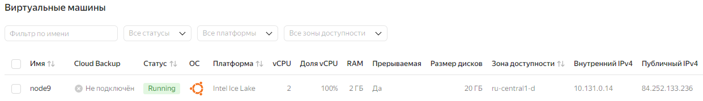
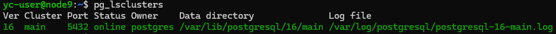
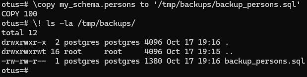
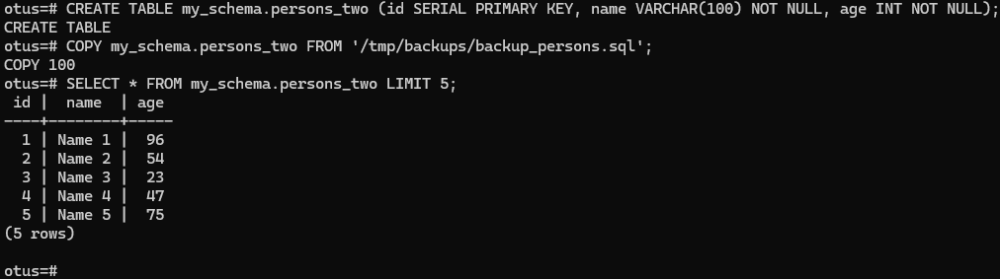
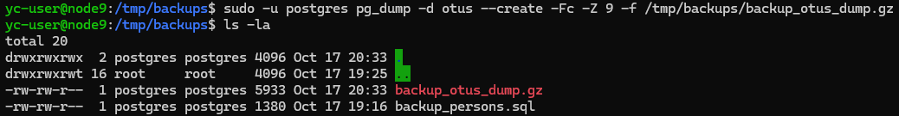
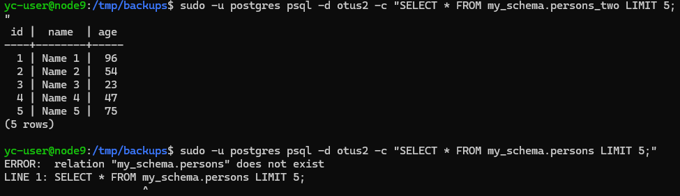
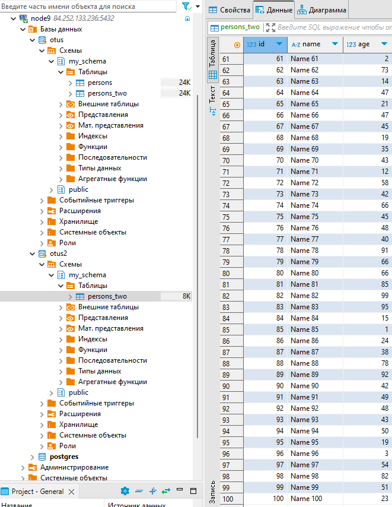
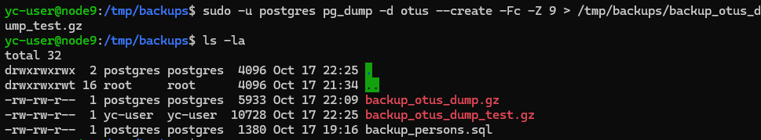

# Домашнее задание
## Бэкапы

### Цель:
* применить логический бэкап. Восстановиться из бэкапа.

## Описание/Пошаговая инструкция выполнения домашнего задания:
* Создаем ВМ/докер c ПГ.
* Создаем БД, схему и в ней таблицу.
* Заполним таблицы автосгенерированными 100 записями.
* Под линукс пользователем Postgres создадим каталог для бэкапов
* Сделаем логический бэкап используя утилиту COPY
* Восстановим в 2 таблицу данные из бэкапа.
* Используя утилиту pg_dump создадим бэкап в кастомном сжатом формате двух таблиц
* Используя утилиту pg_restore восстановим в новую БД только вторую таблицу!

* ДЗ сдается в виде миниотчета на гитхабе с описанием шагов и с какими проблемами столкнулись.

## Выполнение домашнего задания
* Захожу в консоль управления ЯО https://console.yandex.cloud/folders/b1g32bcmj4hctvjuvnou/compute/instances \
> для домашнего задания создал виртуальную машину в ЯО с 2 ядрами и 2 Гб ОЗУ и HDD 20GB\


> подключаюсь к серверу и устанавливаю PostgreSQL 16 с дефолтными настройками
```bash
ssh -i .ssh\yc_key yc-user@84.252.133.236
sudo apt update && sudo apt upgrade -y -q && sudo sh -c 'echo "deb http://apt.postgresql.org/pub/repos/apt $(lsb_release -cs)-pgdg main" > /etc/apt/sources.list.d/pgdg.list' && wget --quiet -O - https://www.postgresql.org/media/keys/ACCC4CF8.asc | sudo apt-key add - && sudo apt-get update && sudo apt -y install postgresql-16
```
> проверяю установился калстер
```bash
pg_lsclusters
```

> Подключаюсь к кластеру. 
```bash
sudo -u postgres psql
```
> Создаю базу даннных **otus**, схему **my_schema** и таблицу **persons**
```sql
CREATE DATABASE otus;
\c otus
CREATE SCHEMA my_schema;
CREATE TABLE my_schema.persons (id SERIAL PRIMARY KEY, name VARCHAR(100) NOT NULL, age INT NOT NULL);
```

Для генерации данных была использована функция generate_series() в сочетании с INSERT:

```sql
INSERT INTO my_schema.persons (name, age)
SELECT 'Name ' || generate_series(1, 100), (random() * 100)::int;
\q
```
>Результат
```sql
yc-user@node9:~$ sudo -u postgres psql
psql (16.4 (Ubuntu 16.4-1.pgdg24.04+2))
Type "help" for help.

postgres=# CREATE DATABASE otus;
CREATE DATABASE
postgres=# \c otus
You are now connected to database "otus" as user "postgres".
otus=# CREATE SCHEMA my_schema;
CREATE SCHEMA
otus=# CREATE TABLE my_schema.persons (id SERIAL PRIMARY KEY, name VARCHAR(100) NOT NULL, age INT NOT NULL);
CREATE TABLE
otus=# INSERT INTO my_schema.persons (name, age)
SELECT 'Name ' || generate_series(1, 100), (random() * 100)::int;
INSERT 0 100
otus=# \q
```
> под пользователем Postgres создаю каталог для архивных копий
```bash
sudo -u postgres mkdir /tmp/backups
```
> Подключаюсь к кластеру и создаю логическую архивную копию таблицы
```bash
sudo -u postgres psql -d otus
```
```sql
\copy my_schema.persons to '/tmp/backups/backup_persons.sql'
\! ls -la /tmp/backups/
```


> Архив создался. Создаю вторую таблицу и восстанавливаю в неё данные из архивной копии
```sql
CREATE TABLE my_schema.persons_two (id SERIAL PRIMARY KEY, name VARCHAR(100) NOT NULL, age INT NOT NULL);
COPY my_schema.persons_two FROM '/tmp/backups/backup_persons.sql';
```
> делаю выборку данных из второй таблицы для проверки восстановления данных из архивной копии
```sql
SELECT * FROM my_schema.persons_two LIMIT 5;
```


* Используя утилиту pg_dump создадим бэкап в кастомном сжатом формате двух таблиц
>выхожу из кластера и запускаю утилиту pg_dump
```sql
\q
```
```bash
sudo -u postgres pg_dump -d otus --create -Fc -Z 9 -f /tmp/backups/backup_otus_dump.gz
```


* Используя утилиту pg_restore восстановим в новую БД только вторую таблицу!

> Cоздаю новую базу данных **otus2**, создаю схему **my_schema** и запускаю восстановление второй таблицы **persons_two** из бэкап в кастомном сжатом формате в новую базу данных **otus2**
```bash
sudo -u postgres createdb -T template0 otus2 && sudo -u postgres psql -d otus2 -c "CREATE SCHEMA my_schema;" && sudo -u postgres pg_restore -d otus2 -n my_schema -t persons_two /tmp/backups/backup_otus_dump.gz
```
> востановленна только втораятаблица
```bash
sudo -u postgres psql -d otus2 -c "SELECT * FROM my_schema.persons_two LIMIT 5;"
sudo -u postgres psql -d otus2 -c "SELECT * FROM my_schema.persons LIMIT 5;"
```


> наглядно в DBeaver




* Столкнулся с правами доступа к каталогу если использовать команду перенаправления вывода >
```bash
sudo -u postgres pg_dump -d otus --create -Fc -Z 9 > /tmp/backups/backup_otus_dump_test.gz
```

> файл создается текущим пользователем и для того что бы успешно выгрузилась архивная копия,  у пользователя должны быть права на запись в этот каталог. \
> можно выдать права всем командой
```bash
sudo chown 777:777 /tmp/backups
```