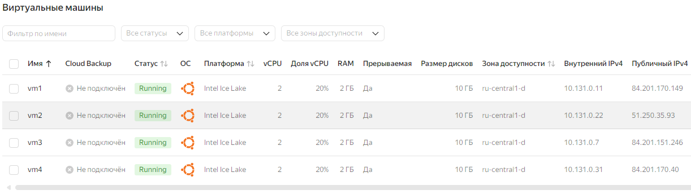

# Домашнее задание
## Репликация

### Цель:
* реализовать свой миникластер на 3 ВМ.

## Описание/Пошаговая инструкция выполнения домашнего задания:
* На 1 ВМ создаем таблицы test для записи, test2 для запросов на чтение.
* Создаем публикацию таблицы test и подписываемся на публикацию таблицы test2 с ВМ №2.
* На 2 ВМ создаем таблицы test2 для записи, test для запросов на чтение.
* Создаем публикацию таблицы test2 и подписываемся на публикацию таблицы test1 с ВМ №1.
3 ВМ использовать как реплику для чтения и бэкапов (подписаться на таблицы из ВМ №1 и №2 ).

### ДЗ сдается в виде миниотчета на гитхабе с описанием шагов и с какими проблемами столкнулись.

* реализовать горячее реплицирование для высокой доступности на 4ВМ. Источником должна выступать ВМ №3. Написать с какими проблемами столкнулись.

## Выполнение домашнего задания
* Захожу в консоль управления ЯО https://console.yandex.cloud/folders/b1g32bcmj4hctvjuvnou/compute/instances \
> для домашнего задания создал 4 виртуальные машину в ЯО с 2 ядрами и 2 Гб ОЗУ и HDD 10GB\



> подключаюсь к серверу и устанавливаю PostgreSQL 16 с дефолтными настройками
```bash
ssh -i .ssh\yc_key yc-user@84.252.133.236
sudo apt update && sudo apt upgrade -y -q && sudo sh -c 'echo "deb http://apt.postgresql.org/pub/repos/apt $(lsb_release -cs)-pgdg main" > /etc/apt/sources.list.d/pgdg.list' && wget --quiet -O - https://www.postgresql.org/media/keys/ACCC4CF8.asc | sudo apt-key add - && sudo apt-get update && sudo apt -y install postgresql-16
```
> выполняю настройку кластера на сервере  VM1 И VM2
```bash
sudo nano /etc/postgresql/16/main/pg_hba.conf
```
> в конце файла  дописываем строку
```
host    all             all             10.131.0.0/24           scram-sha-256
```
> сохраняю файл последовательно нажимая Ctrl+o , Enter , Ctrl+x \

```bash
sudo nano /etc/postgresql/16/main/postgresql.conf
```
```
#------------------------------------------------------------------------------
# CONNECTIONS AND AUTHENTICATION
#------------------------------------------------------------------------------

# - Connection Settings -

listen_addresses = '*'          # what IP address(es) to listen on;
#------------------------------------------------------------------------------
# WRITE-AHEAD LOG
#------------------------------------------------------------------------------

# - Settings -

wal_level = logical                     # minimal, replica, or logical
```
> перезагружаю кластер
```bash
sudo pg_ctlcluster 16 main restart
```

* подключаюсь к кластеру на VM1
```bash
sudo -u postgres psql 
```
```sql

-- задаю пароль для пользователя БД postgres 
ALTER ROLE postgres PASSWORD 'postgres';

-- Создаю таблицы:
-- Создаю таблицу test для записи.
-- Создаю таблицу test2 для запросов на чтение.

CREATE TABLE test (id SERIAL PRIMARY KEY, data VARCHAR);
CREATE TABLE test2 (id SERIAL PRIMARY KEY, info VARCHAR);
--Настройка публикаций:
--Создаю публикацию для таблицы test.
CREATE PUBLICATION pub_test FOR TABLE test;
-- смотрю созданную публикацию
\dRp+
--                             Publication pub_test
--  Owner   | All tables | Inserts | Updates | Deletes | Truncates | Via root
----------+------------+---------+---------+---------+-----------+----------
-- postgres | f          | t       | t       | t       | t         | f
--Tables:
--    "public.test"
```

* подключаюсь к кластеру на VM2
```bash
sudo -u postgres psql 
```
```sql

-- задаю пароль для пользователя БД postgres 
ALTER ROLE postgres PASSWORD 'postgres';

-- Создаю таблицы:
-- Создаю таблицу test для записи.
-- Создаю таблицу test2 для запросов на чтение.

CREATE TABLE test (id SERIAL PRIMARY KEY, data VARCHAR);
CREATE TABLE test2 (id SERIAL PRIMARY KEY, info VARCHAR);
--Настройка публикаций:
-- подписываюсь на публикацию pub_test.
CREATE SUBSCRIPTION sub_test CONNECTION 'host=10.131.0.11 dbname=postgres user=postgres password=postgres' PUBLICATION pub_test WITH (copy_data = true);
-- проверяю подписку на публикацию
\dRs
SELECT * FROM pg_stat_subscription \gx

--
--            List of subscriptions
--   Name   |  Owner   | Enabled | Publication
----------+----------+---------+-------------
-- sub_test | postgres | t       | {pub_test}
--(1 row)
--
--postgres=# SELECT * FROM pg_stat_subscription \gx
---[ RECORD 1 ]---------+------------------------------
--subid                 | 16409
--subname               | sub_test
--pid                   | 10573
--leader_pid            |
--relid                 |
--received_lsn          | 0/15681B0
--last_msg_send_time    | 2024-10-18 00:32:34.465833+00
--last_msg_receipt_time | 2024-10-18 00:32:34.463112+00
--latest_end_lsn        | 0/15681B0
--latest_end_time       | 2024-10-18 00:32:34.465833+00


--Создаю публикацию для таблицы test2.
CREATE PUBLICATION pub_test2 FOR TABLE test2;

-- смотрю созданную публикацию
\dRp+
--                            Publication pub_test2
--  Owner   | All tables | Inserts | Updates | Deletes | Truncates | Via root
----------+------------+---------+---------+---------+-----------+----------
-- postgres | f          | t       | t       | t       | t         | f
--Tables:
--    "public.test2"
```
> На VM1 подписываемся на публикацию pub_test2.
```sql
-- подписываюсь на публикацию pub_test2.
CREATE SUBSCRIPTION sub_test2 CONNECTION 'host=10.131.0.22 dbname=postgres user=postgres password=postgres' PUBLICATION pub_test2 WITH (copy_data = true);
-- проверяю подписку на публикацию
\dRs
SELECT * FROM pg_stat_subscription \gx
-- postgres=# \dRs
--             List of subscriptions
--    Name    |  Owner   | Enabled | Publication
-----------+----------+---------+-------------
--  sub_test2 | postgres | t       | {pub_test2}
-- (1 row)
-- 
-- postgres=# SELECT * FROM pg_stat_subscription \gx
-- -[ RECORD 1 ]---------+------------------------------
-- subid                 | 16408
-- subname               | sub_test2
-- pid                   | 9948
-- leader_pid            |
-- relid                 |
-- received_lsn          | 0/1584840
-- last_msg_send_time    | 2024-10-18 00:41:42.961938+00
-- last_msg_receipt_time | 2024-10-18 00:41:42.963645+00
-- latest_end_lsn        | 0/1584840
-- latest_end_time       | 2024-10-18 00:41:42.961938+00
```
* подключаюсь к кластеру на VM3
> выполняю настройку кластера на сервере  VM3
```bash
sudo nano /etc/postgresql/16/main/pg_hba.conf
```
> в конце файла  дописываем строку
```
host    replication     all             10.131.0.0/24           md5
host    all             all             10.131.0.0/24           md5
```
> сохраняю файл последовательно нажимая Ctrl+o , Enter , Ctrl+x \

```bash
sudo nano /etc/postgresql/16/main/postgresql.conf
```
```
#------------------------------------------------------------------------------
# CONNECTIONS AND AUTHENTICATION
#------------------------------------------------------------------------------

# - Connection Settings -

listen_addresses = '*'          # what IP address(es) to listen on;
#------------------------------------------------------------------------------
# WRITE-AHEAD LOG
#------------------------------------------------------------------------------

# - Settings -

wal_level = hot_standby                     # minimal, replica, or logical
max_wal_senders = 1  # число ВМ-реплик
hot_standby = on
```
> перезагружаю кластер
```bash
sudo pg_ctlcluster 16 main stop
```

```bash
sudo -u postgres psql 
```
```sql

-- задаю пароль для пользователя БД postgres 
ALTER ROLE postgres PASSWORD 'postgres';

-- Создаю таблицы:
-- Создаю таблицу test для записи.
-- Создаю таблицу test2 для запросов на чтение.

CREATE TABLE test (id SERIAL PRIMARY KEY, data VARCHAR);
CREATE TABLE test2 (id SERIAL PRIMARY KEY, info VARCHAR);
--Настройка подписок:
-- подписываюсь на публикацию pub_test с VM1.
CREATE SUBSCRIPTION sub_test3_1 CONNECTION 'host=10.131.0.11 dbname=postgres user=postgres password=postgres' PUBLICATION pub_test WITH (copy_data = true);
CREATE SUBSCRIPTION sub_test3_2 CONNECTION 'host=10.131.0.22 dbname=postgres user=postgres password=postgres' PUBLICATION pub_test2 WITH (copy_data = true);
-- проверяю подписку на публикацию
\dRs
SELECT * FROM pg_stat_subscription \gx

-- postgres=# \dRs
--              List of subscriptions
--     Name     |  Owner   | Enabled | Publication
-------------+----------+---------+-------------
--  sub_test3_1 | postgres | t       | {pub_test}
--  sub_test3_2 | postgres | t       | {pub_test2}
-- (2 rows)
-- 
-- postgres=# SELECT * FROM pg_stat_subscription \gx
-- -[ RECORD 1 ]---------+------------------------------
-- subid                 | 16408
-- subname               | sub_test3_1
-- pid                   | 10925
-- leader_pid            |
-- relid                 |
-- received_lsn          | 0/156F178
-- last_msg_send_time    | 2024-10-18 01:07:33.46542+00
-- last_msg_receipt_time | 2024-10-18 01:07:33.465237+00
-- latest_end_lsn        | 0/156F178
-- latest_end_time       | 2024-10-18 01:07:33.46542+00
-- -[ RECORD 2 ]---------+------------------------------
-- subid                 | 16409
-- subname               | sub_test3_2
-- pid                   | 10928
-- leader_pid            |
-- relid                 |
-- received_lsn          | 0/1584C48
-- last_msg_send_time    | 2024-10-18 01:07:27.133976+00
-- last_msg_receipt_time | 2024-10-18 01:07:27.132676+00
-- latest_end_lsn        | 0/1584C48
-- latest_end_time       | 2024-10-18 01:07:27.133976+00


-- создаю слот репликации для VM4
select pg_create_physical_replication_slot('pub_vm3');

-- проверяю как создался слот
postgres=# select * from pg_replication_slots \gx
---[ RECORD 1 ]-------+---------
--slot_name           | pub_vm3
--plugin              |
--slot_type           | physical
--datoid              |
--database            |
--temporary           | f
--active              | f
--active_pid          |
--xmin                |
--catalog_xmin        |
--restart_lsn         |
--confirmed_flush_lsn |
--wal_status          |
--safe_wal_size       |
--two_phase           | f
--conflicting         |

```


* подключаюсь к кластеру на VM4 будет репликой для чтения и резервного копирования.
> выполняю настройку кластера на сервере  VM4
```bash
sudo nano /etc/postgresql/16/main/pg_hba.conf
```
> в конце файла  дописываем строку
```
host    all             all             10.131.0.0/24           md5
```
> сохраняю файл последовательно нажимая Ctrl+o , Enter , Ctrl+x \

```bash
sudo nano /etc/postgresql/16/main/postgresql.conf
```
```
#------------------------------------------------------------------------------
# CONNECTIONS AND AUTHENTICATION
#------------------------------------------------------------------------------

# - Connection Settings -

listen_addresses = '*'          # what IP address(es) to listen on;
#------------------------------------------------------------------------------
# WRITE-AHEAD LOG
#------------------------------------------------------------------------------

# - Settings -

wal_level = hot_standby                     # minimal, replica, or logical
max_wal_senders = 1  # число ВМ-реплик
hot_standby = on
```

> Прежде чем VM4 сможет начать реплицировать данные, нужно создать новую БД, идентичную VM3. Для этого воспользуюсь утилитой pg_basebackup. Она создаст бэкап с Master-сервера и скачает его на Replica-сервер. Эту операцию нужно выполнять от имени пользователя postgres, поэтому логинюсь от него:
```bash
sudo su - postgres
```
> Далее перехожу в каталог с базой данных:
```bash
cd /var/lib/postgresql/16/
```
> Удаляю каталог с дефолтной БД и снова его создаю, но уже пустой:
```bash
rm -rf main; mkdir main; chmod go-rwx main
```
> Теперь выгружаю БД с VM3. Для выполнения этой команды нужно будет ввести пароль от пользователя postgres.
```bash
pg_basebackup -P -R -X stream -c fast -h 10.131.0.7 -U postgres -D ./main
```
> В этой команде есть важный параметр -R. Он означает, что PostgreSQL-сервер также создаст пустой файл standby.signal. Несмотря на то, что файл пустой, само наличие этого файла означает, что этот сервер — реплика.
> Возвращаюсь в root-пользователя и запускаем PostgreSQL-сервер:
```bash
exit
sudo pg_ctlcluster 16 main start
pg_lsclusters
```

## Выполняем тестирование
* На **VM1** зайдеу на кластер постгрес и добавлю строчку в таблицу **test**
```bash
sudo -u postgres psql 
```
```sql 
INSERT INTO test (id, data) values (1,200);
INSERT INTO test (id, data) values (2,200);
```
* На **VM2** зайдеу на кластер постгрес и сделаю запрос в таблицу **test**
```bash 
sudo -u postgres psql 
```
```sql
SELECT * FROM test;
--  id | data
----+------
--  1 | 100
--  2 | 200
--(2 rows)

-- добавлю строчку в таблицу **test2**
INSERT INTO test2 (id, info) values (1,300);
```
* На **VM1** сделаю запрос в таблицу **test2**
```sql
SELECT * FROM test2;
-- postgres=# select * from test2;
-- id | info
------+------
--  1 | 300
-- (1 row)
```
* На **VM3** зайдеу на кластер постгрес и сделаю запрос в таблицам **test** и **test2**
```bash 
sudo -u postgres psql 
```
```sql
SELECT * FROM test;
SELECT * FROM test2;

-- postgres=# SELECT * FROM test;
--  id | data
-- ----+------
--   1 | 100
--   2 | 200
-- (2 rows)
-- 
-- postgres=# SELECT * FROM test2;
--  id | info
-- ----+------
--   1 | 300
-- (1 row)
```

 На **VM4** зайдеу на кластер постгрес и сделаю запрос в таблицам **test** и **test2**
```bash 
sudo -u postgres psql 
```
```sql
SELECT * FROM test;
SELECT * FROM test2;

-- postgres=# SELECT * FROM test;
--  id | data
-- ----+------
--   1 | 100
--   2 | 200
-- (2 rows)
-- 
-- postgres=# SELECT * FROM test2;
--  id | info
-- ----+------
--   1 | 300
-- (1 row)
```
