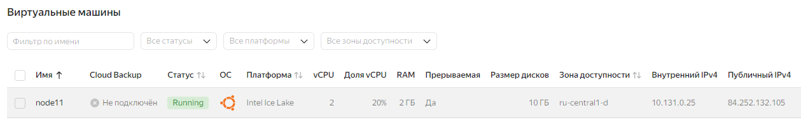

# Домашнее задание
## Секционирование таблицы

### Цель:
*  научиться секционировать таблицы.

### Описание/Пошаговая инструкция выполнения домашнего задания:
* Секционировать большую таблицу из демо базы flights.

## Выполнение домашнего задания
* Захожу в консоль управления ЯО https://console.yandex.cloud/folders/b1g32bcmj4hctvjuvnou/compute/instances \
> для домашнего задания создал 4 виртуальные машину в ЯО с 2 ядрами и 2 Гб ОЗУ и HDD 10GB\


> Подключаюсь к серверу и устанавливаю PostgreSQL 16 с дефолтными настройками 
```bash
ssh -i .ssh\yc_key yc-user@84.252.132.105
sudo apt update && sudo apt upgrade -y -q && sudo sh -c 'echo "deb http://apt.postgresql.org/pub/repos/apt $(lsb_release -cs)-pgdg main" > /etc/apt/sources.list.d/pgdg.list' && wget --quiet -O - https://www.postgresql.org/media/keys/ACCC4CF8.asc | sudo apt-key add - && sudo apt-get update && sudo apt -y install postgresql-16
```
> Разворачиваю Демонстрационную базу данных по полетам за один месяц
```bash
sudo su - postgres 
wget https://edu.postgrespro.ru/demo-small.zip && zcat demo-small.zip | psql
psql -d demo 
```
> устанавливаю по умолчанию **search_path** для схемы **bookings**
```sql
alter database demo set search_path to bookings;
```

> Изучаю таблицы и выбираю самую большую
```sql
\d+
```
```sql

                                                       List of relations
  Schema  |         Name          |   Type   |  Owner   | Persistence | Access method |    Size    |        Description
----------+-----------------------+----------+----------+-------------+---------------+------------+---------------------------
 bookings | aircrafts             | view     | postgres | permanent   |               | 0 bytes    | Aircrafts
 bookings | aircrafts_data        | table    | postgres | permanent   | heap          | 16 kB      | Aircrafts (internal data)
 bookings | airports              | view     | postgres | permanent   |               | 0 bytes    | Airports
 bookings | airports_data         | table    | postgres | permanent   | heap          | 56 kB      | Airports (internal data)
 bookings | boarding_passes       | table    | postgres | permanent   | heap          | 34 MB      | Boarding passes
 bookings | bookings              | table    | postgres | permanent   | heap          | 13 MB      | Bookings
 bookings | flights               | table    | postgres | permanent   | heap          | 3168 kB    | Flights
 bookings | flights_flight_id_seq | sequence | postgres | permanent   |               | 8192 bytes |
 bookings | flights_v             | view     | postgres | permanent   |               | 0 bytes    | Flights (extended)
 bookings | routes                | view     | postgres | permanent   |               | 0 bytes    | Routes
 bookings | seats                 | table    | postgres | permanent   | heap          | 96 kB      | Seats
 bookings | ticket_flights        | table    | postgres | permanent   | heap          | 69 MB      | Flight segment
 bookings | tickets               | table    | postgres | permanent   | heap          | 48 MB      | Tickets
(13 rows)
```
> самая большая таблица **ticket_flights** объёмом 69 MB . Изучаю структуру таблицы
```
\d ticket_flights
```
```sql
                     Table "bookings.ticket_flights"
     Column      |         Type          | Collation | Nullable | Default
-----------------+-----------------------+-----------+----------+---------
 ticket_no       | character(13)         |           | not null |
 flight_id       | integer               |           | not null |
 fare_conditions | character varying(10) |           | not null |
 amount          | numeric(10,2)         |           | not null |
Indexes:
    "ticket_flights_pkey" PRIMARY KEY, btree (ticket_no, flight_id)
Check constraints:
    "ticket_flights_amount_check" CHECK (amount >= 0::numeric)
    "ticket_flights_fare_conditions_check" CHECK (fare_conditions::text = ANY (ARRAY['Economy'::character varying::text, 'Comfort'::character varying::text, 'Business'::character varying::text]))
Foreign-key constraints:
    "ticket_flights_flight_id_fkey" FOREIGN KEY (flight_id) REFERENCES flights(flight_id)
    "ticket_flights_ticket_no_fkey" FOREIGN KEY (ticket_no) REFERENCES tickets(ticket_no)
Referenced by:
    TABLE "boarding_passes" CONSTRAINT "boarding_passes_ticket_no_fkey" FOREIGN KEY (ticket_no, flight_id) REFERENCES ticket_flights(ticket_no, flight_id)
```
> Посмотрю план запроса к таблице
```sql
explain
SELECT * FROM bookings.ticket_flights WHERE ticket_no = '0005435212366';
--                                       QUERY PLAN
-- ---------------------------------------------------------------------------------------
--  Bitmap Heap Scan on ticket_flights  (cost=144.95..8136.60 rows=5229 width=114)
--    Recheck Cond: (ticket_no = '0005435212366'::bpchar)
--    ->  Bitmap Index Scan on ticket_flights_pkey  (cost=0.00..143.64 rows=5229 width=0)
--          Index Cond: (ticket_no = '0005435212366'::bpchar)
-- (4 rows)
```

> создаю новую секционированную таблицу с теми же столбцами и ограничениями, что и у исходной таблицы. 
```sql
CREATE TABLE bookings.ticket_flights_partitioned (
    ticket_no character(13) NOT NULL,
    flight_id integer NOT NULL,
    fare_conditions character varying(10) NOT NULL,
    amount numeric(10,2) NOT NULL,
    CONSTRAINT ticket_flights_partitioned_pkey PRIMARY KEY (ticket_no, flight_id),
    CONSTRAINT ticket_flights_partitioned_amount_check CHECK (amount >= 0::numeric),
    CONSTRAINT ticket_flights_partitioned_fare_conditions_check CHECK (fare_conditions::text = ANY (ARRAY['Economy'::character varying::text, 'Comfort'::character varying::text, 'Business'::character varying::text])),
    CONSTRAINT ticket_flights_partitioned_flight_id_fkey FOREIGN KEY (flight_id) REFERENCES bookings.flights(flight_id),
    CONSTRAINT ticket_flights_partitioned_ticket_no_fkey FOREIGN KEY (ticket_no) REFERENCES bookings.tickets(ticket_no)
) PARTITION BY HASH (ticket_no);
```
> Создаю 4 секции для таблицы.
```sql
CREATE TABLE bookings.ticket_flights_partitioned_0 PARTITION OF bookings.ticket_flights_partitioned FOR VALUES WITH (MODULUS 4, REMAINDER 0);
CREATE TABLE bookings.ticket_flights_partitioned_1 PARTITION OF bookings.ticket_flights_partitioned FOR VALUES WITH (MODULUS 4, REMAINDER 1);
CREATE TABLE bookings.ticket_flights_partitioned_2 PARTITION OF bookings.ticket_flights_partitioned FOR VALUES WITH (MODULUS 4, REMAINDER 2);
CREATE TABLE bookings.ticket_flights_partitioned_3 PARTITION OF bookings.ticket_flights_partitioned FOR VALUES WITH (MODULUS 4, REMAINDER 3);
```
> Переношу данные из исходной таблицы **bookings.ticket_flights** в новую секционированную таблицу **bookings.ticket_flights_partitioned**:
```sql
INSERT INTO bookings.ticket_flights_partitioned (ticket_no, flight_id, fare_conditions, amount)
SELECT ticket_no, flight_id, fare_conditions, amount
FROM bookings.ticket_flights;
-- INSERT 0 1045726
```
> Есть таблица **boarding_passes** которая ссылается на **ticket_flights**. Переключаю эту ссылку на новую секционированную таблицу.
```sql
ALTER TABLE bookings.boarding_passes
    DROP CONSTRAINT boarding_passes_ticket_no_fkey,
    ADD CONSTRAINT boarding_passes_ticket_no_fkey FOREIGN KEY (ticket_no, flight_id) REFERENCES bookings.ticket_flights_partitioned(ticket_no, flight_id);
```
> Переименовываю таблицы
```sql
ALTER TABLE bookings.ticket_flights RENAME TO ticket_flights_old;
ALTER TABLE bookings.ticket_flights_partitioned RENAME TO ticket_flights;
```
> Посмотрю план запроса к таблице
```sql
explain
SELECT * FROM bookings.ticket_flights WHERE ticket_no = '0005435212366';

--                                              QUERY PLAN
-- -----------------------------------------------------------------------------------------------------
--  Bitmap Heap Scan on ticket_flights_partitioned_1 ticket_flights  (cost=4.44..16.15 rows=3 width=32)
--    Recheck Cond: (ticket_no = '0005435212366'::bpchar)
--    ->  Bitmap Index Scan on ticket_flights_partitioned_1_pkey  (cost=0.00..4.44 rows=3 width=0)
--          Index Cond: (ticket_no = '0005435212366'::bpchar)
-- (4 rows)
```
> Вижу что обращение идет к секции **ticket_flights_partitioned_1** 