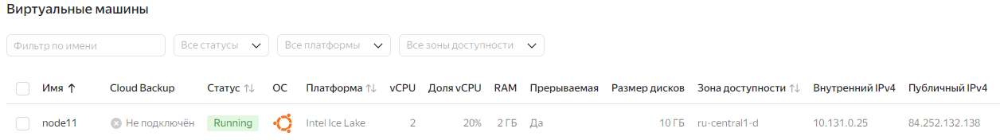
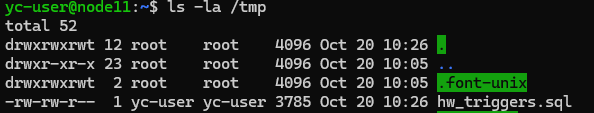
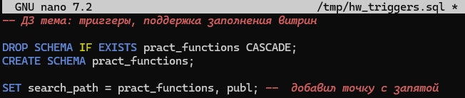

# Домашнее задание
## Триггеры, поддержка заполнения витрин

### Цель:
* Создать триггер для поддержки витрины в актуальном состоянии.


### Описание/Пошаговая инструкция выполнения домашнего задания:

* Скрипт и развернутое описание задачи – в ЛК (файл hw_triggers.sql) или по ссылке: https://disk.yandex.ru/d/l70AvknAepIJXQ

* В БД создана структура, описывающая товары (таблица goods) и продажи (таблица sales).

* Есть запрос для генерации отчета – сумма продаж по каждому товару.

* БД была денормализована, создана таблица (витрина), структура которой повторяет структуру отчета.

* Создать триггер на таблице продаж, для поддержки данных в витрине в актуальном состоянии (вычисляющий при каждой продаже сумму и записывающий её в витрину)

    * Подсказка: не забыть, что кроме INSERT есть еще UPDATE и DELETE

### Задание со звездочкой*
* Чем такая схема (витрина+триггер) предпочтительнее отчета, создаваемого "по требованию" (кроме производительности)?
    * Подсказка: В реальной жизни возможны изменения цен.

## Выполнение домашнего задания
* Захожу в консоль управления ЯО https://console.yandex.cloud/folders/b1g32bcmj4hctvjuvnou/compute/instances \
> для домашнего задания создал 4 виртуальные машину в ЯО с 2 ядрами и 2 Гб ОЗУ и HDD 10GB\


> Скачиваю файл файл **hw_triggers.sql** по ссылке: https://disk.yandex.ru/d/l70AvknAepIJXQ и сохраняю его на компьютер в папку C:\TEMP
> Копирую файл на сервер в папку /tmp
```bash
scp -i .ssh\yc_key C:\TEMP\hw_triggers.sql yc-user@84.252.132.138:/tmp
```
> Подключаюсь к серверу и Устанавливаю PostgreSQL 16 с дефолтными настройками 
```bash
ssh -i .ssh\yc_key yc-user@84.252.132.138

sudo apt update && sudo apt upgrade -y -q && sudo sh -c 'echo "deb http://apt.postgresql.org/pub/repos/apt $(lsb_release -cs)-pgdg main" > /etc/apt/sources.list.d/pgdg.list' && wget --quiet -O - https://www.postgresql.org/media/keys/ACCC4CF8.asc | sudo apt-key add - && sudo apt-get update && sudo apt -y install postgresql-16
```
> проверяю что файл скопирован 
```bash
ls -la /tmp
```

> открою в редакторе этот файл исправлю опечатку в 6 строке добавив точку с запятой  и смотрю развернутое описание задачи 
```bash
nano /tmp/hw_triggers.sql
```


```sql
-- ДЗ тема: триггеры, поддержка заполнения витрин

DROP SCHEMA IF EXISTS pract_functions CASCADE;
CREATE SCHEMA pract_functions;

SET search_path = pract_functions, publ; -- добавить точку с запятой

-- товары:
CREATE TABLE goods
(
    goods_id    integer PRIMARY KEY,
    good_name   varchar(63) NOT NULL,
    good_price  numeric(12, 2) NOT NULL CHECK (good_price > 0.0)
);
INSERT INTO goods (goods_id, good_name, good_price)
VALUES 	(1, 'Спички хозайственные', .50),
		(2, 'Автомобиль Ferrari FXX K', 185000000.01);

-- Продажи
CREATE TABLE sales
(
    sales_id    integer GENERATED ALWAYS AS IDENTITY PRIMARY KEY,
    good_id     integer REFERENCES goods (goods_id),
    sales_time  timestamp with time zone DEFAULT now(),
    sales_qty   integer CHECK (sales_qty > 0)
);

INSERT INTO sales (good_id, sales_qty) VALUES (1, 10), (1, 1), (1, 120), (2, 1);

-- отчет:
SELECT G.good_name, sum(G.good_price * S.sales_qty)
FROM goods G
INNER JOIN sales S ON S.good_id = G.goods_id
GROUP BY G.good_name;

-- с увеличением объёма данных отчет стал создаваться медленно
-- Принято решение денормализовать БД, создать таблицу
CREATE TABLE good_sum_mart
(
	good_name   varchar(63) NOT NULL,
	sum_sale	numeric(16, 2)NOT NULL
);

-- Создать триггер (на таблице sales) для поддержки.
-- Подсказка: не забыть, что кроме INSERT есть еще UPDATE и DELETE

-- Чем такая схема (витрина+триггер) предпочтительнее отчета, создаваемого "по требованию" (кроме производительности)?
-- Подсказка: В реальной жизни возможны изменения цен.
```

> Разворачиваю Скрипт из описания задания
```bash
sudo -u postgres psql -d postgres -f /tmp/hw_triggers.sql  

# yc-user@node11:~$ sudo -u postgres psql -d postgres -f /tmp/hw_triggers.sql
# psql:/tmp/hw_triggers.sql:3: NOTICE:  schema "pract_functions" does not exist, skipping
# DROP SCHEMA
# CREATE SCHEMA
# SET
# CREATE TABLE
# INSERT 0 2
# CREATE TABLE
# INSERT 0 4
#         good_name         |     sum
# --------------------------+--------------
#  Автомобиль Ferrari FXX K | 185000000.01
#  Спички хозайственные     |        65.50
# (2 rows)
# 
# CREATE TABLE
```
> Схема и таблицы созданы, подключаюсь к кластеру
```bash
sudo -u postgres psql
```
> былв создана витрина **good_sum_mart** посмотрю какие в ней сейчас данные
```sql
SET search_path = pract_functions, publ;
SELECT * FROM good_sum_mart;

-- postgres=# SET search_path = pract_functions, publ;
-- SET
-- postgres=# SELECT * FROM good_sum_mart;
--  good_name | sum_sale
-- -----------+----------
-- (0 rows)
```

> Витрина пустая, инициализирую витрину начальными данными
```sql
INSERT INTO good_sum_mart (good_name, sum_sale)
SELECT G.good_name, SUM(G.good_price * S.sales_qty)
FROM goods G
INNER JOIN sales S ON S.good_id = G.goods_id
GROUP BY G.good_name;

SELECT * FROM good_sum_mart;

-- INSERT 0 2
-- postgres=# SELECT * FROM good_sum_mart;
--         good_name         |   sum_sale
-- --------------------------+--------------
--  Автомобиль Ferrari FXX K | 185000000.01
--  Спички хозайственные     |        65.50
-- (2 rows)
```
> данные заполнены, создаю функцию для тригера таблицы **sales**
```sql
CREATE OR REPLACE FUNCTION update_good_sum_mart() RETURNS TRIGGER AS $$
BEGIN
    -- Обработка INSERT
    IF TG_OP = 'INSERT' THEN
        UPDATE good_sum_mart
        SET sum_sale = sum_sale + NEW.sales_qty * (SELECT good_price FROM goods WHERE goods_id = NEW.good_id)
        WHERE good_name = (SELECT good_name FROM goods WHERE goods_id = NEW.good_id);
        RETURN NEW;

    -- Обработка DELETE
    ELSIF TG_OP = 'DELETE' THEN
        UPDATE good_sum_mart
        SET sum_sale = sum_sale - OLD.sales_qty * (SELECT good_price FROM goods WHERE goods_id = OLD.good_id)
        WHERE good_name = (SELECT good_name FROM goods WHERE goods_id = OLD.good_id);
        RETURN OLD;

    -- Обработка UPDATE
    ELSIF TG_OP = 'UPDATE' THEN
        UPDATE good_sum_mart
        SET sum_sale = sum_sale - OLD.sales_qty * (SELECT good_price FROM goods WHERE goods_id = OLD.good_id)
        WHERE good_name = (SELECT good_name FROM goods WHERE goods_id = OLD.good_id);

        UPDATE good_sum_mart
        SET sum_sale = sum_sale + NEW.sales_qty * (SELECT good_price FROM goods WHERE goods_id = NEW.good_id)
        WHERE good_name = (SELECT good_name FROM goods WHERE goods_id = NEW.good_id);
        RETURN NEW;
    END IF;

    RETURN NULL;
END;
$$ LANGUAGE plpgsql;

-- CREATE FUNCTION
```
> создаю тригер на таблице **sales**
```sql
CREATE TRIGGER sales_trigger
AFTER INSERT OR UPDATE OR DELETE ON sales
FOR EACH ROW EXECUTE FUNCTION update_good_sum_mart();

-- CREATE TRIGGER
```
> проверяю что тригер работает добавляя, удаляя и обновляя данные в таблице **sales**
```sql
INSERT INTO sales (good_id, sales_qty) VALUES (2, 2);
SELECT * FROM good_sum_mart;

-- INSERT 0 1
--         good_name         |   sum_sale
-- --------------------------+--------------
--  Спички хозайственные     |        65.50
--  Автомобиль Ferrari FXX K | 555000000.03
-- (2 rows)

DELETE FROM sales WHERE good_id = 2 AND  sales_qty = 2;
SELECT * FROM good_sum_mart;

-- DELETE 1
-- 
--         good_name         |   sum_sale
-- --------------------------+--------------
--  Спички хозайственные     |        65.50
--  Автомобиль Ferrari FXX K | 185000000.01
-- (2 rows)

UPDATE sales SET sales_qty =  20 WHERE good_id = 1 AND  sales_qty = 10;
SELECT * FROM good_sum_mart;

-- UPDATE 1
--         good_name         |   sum_sale
-- --------------------------+--------------
--  Автомобиль Ferrari FXX K | 185000000.01
--  Спички хозайственные     |        70.50
-- (2 rows)
```
> поменяю цену на товар в таблице **goods** и добавлю стору в таблицу **sales**
```sql
UPDATE goods SET good_price =  .70 WHERE goods_id = 1;
INSERT INTO sales (good_id, sales_qty) VALUES (1, 5);
-- Витрина
SELECT * FROM good_sum_mart;
-- отчет:
SELECT G.good_name, sum(G.good_price * S.sales_qty)
FROM goods G
INNER JOIN sales S ON S.good_id = G.goods_id
GROUP BY G.good_name;


-- UPDATE 1
-- INSERT 0 1
--         good_name         |   sum_sale           -- Витрина:
-- --------------------------+--------------
--  Автомобиль Ferrari FXX K | 185000000.01
--  Спички хозайственные     |        74.00
-- (2 rows)
-- 
--         good_name         |     sum              -- Отчет:
-- --------------------------+--------------
--  Автомобиль Ferrari FXX K | 185000000.01
--  Спички хозайственные     |       102.20    
--- (2 rows)

-- при изменении цены отчет по требованию пересчитал сумму на все продажи с новой ценой
```

Плюсы использоватния витрины данных

Производительность:

Витрина с триггером позволяет быстро получать актуальные данные, так как она всегда находится в актуальном состоянии. Это особенно важно при больших объемах данных, когда создание отчета "по требованию" может занимать значительное время.

Упрощение доступа:

Витрина предоставляет упрощенный и оптимизированный способ доступа к данным, что упрощает разработку и поддержку приложений, которые используют эти данные.

Актуальность данных:

Изменения цен: В реальной жизни цены на товары могут меняться. Если использовать отчет "по требованию", то при изменении цены данные в отчете могут быть неактуальными до тех пор, пока отчет не будет пересоздан. Витрина с триггером автоматически обновляется при изменении данных в таблице sales.
