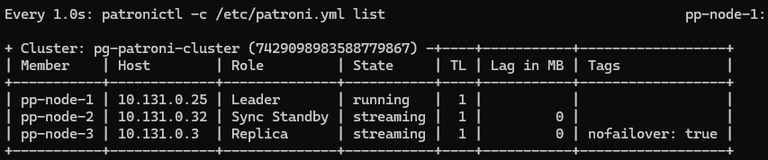
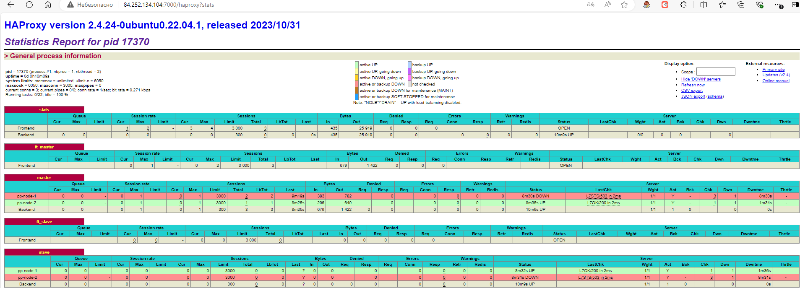

# Проектная работа

## Темы для работы:
* Cоздание и тестирование высоконагруженного отказоустойчивого кластера PostgreSQL на базе Patroni


## Выполнение проекта

Создание кластера PostgreSQL с использованием Patroni и etcd в Яндекс Облаке — задача, требующая внимательной подготовки и настройки. Давайте пройдёмся по шагам, необходимым для успешной реализации проекта.

### Шаг 1: Подготовка серверов в Яндекс Облаке


* Захожу в консоль управления ЯО https://console.yandex.cloud/folders/b1g32bcmj4hctvjuvnou/compute/instances \

> для проектного задания создаю 7 виртуальных серверов в ЯО с 2 ядрами, 4GB ОЗУ, SSD 20GB\


> Общая схема кластера


### Шаг 2. Настраиваю **etcd** кластер

> Подключаюсь к серверам **etcd** и устанавливаю необходимые пакеты
* Подкючение к серверам
    ```bash 
    ssh -i .ssh\yc_key yc-user@84.201.169.162
    ssh -i .ssh\yc_key yc-user@51.250.33.39
    ssh -i .ssh\yc_key yc-user@84.252.135.239
    ```
* Установливаю etch 
```bash
sudo apt update && sudo apt upgrade -y -q && sudo apt -y install etcd
```


* Настраиваю IP-адресацию. Записываю IP-адреса в файл hosts на каждой ВМ:
```bash
echo "10.131.0.30  etcd-node-1" | sudo tee -a /etc/hosts
echo "10.131.0.37  etcd-node-2" | sudo tee -a /etc/hosts
echo "10.131.0.17  etcd-node-3" | sudo tee -a /etc/hosts
echo "10.131.0.25  pp-node-1" | sudo tee -a /etc/hosts
echo "10.131.0.32  pp-node-2" | sudo tee -a /etc/hosts
echo "10.131.0.3  pp-node-3" | sudo tee -a /etc/hosts
echo "10.131.0.4  haproxy-1" | sudo tee -a /etc/hosts

```


Редактирую файл конфигурации etcd /etc/default/etcd: В конце файла добавляю на **etcd-node-1**
```bash
sudo nano /etc/default/etcd
```
```
ETCD_NAME="etcd-node-1"
ETCD_LISTEN_CLIENT_URLS="http://0.0.0.0:2379"
ETCD_ADVERTISE_CLIENT_URLS="http://10.131.0.30:2379"
ETCD_LISTEN_PEER_URLS="http://0.0.0.0:2380"
ETCD_INITIAL_ADVERTISE_PEER_URLS="http://10.131.0.30:2380"
ETCD_INITIAL_CLUSTER="etcd-node-1=http://10.131.0.30:2380,etcd-node-2=http://10.131.0.37:2380,etcd-node-3=http://10.131.0.17:2380"
ETCD_DATA_DIR="/var/lib/etcd"
ETCD_INITIAL_CLUSTER_STATE="new"
ETCD_INITIAL_CLUSTER_TOKEN="etcd-patroni-claster"

```
Редактирую файл конфигурации etcd /etc/default/etcd: В конце файла добавляю на **etcd-node-2**
```bash
sudo nano /etc/default/etcd
```
```
ETCD_NAME="etcd-node-2"
ETCD_LISTEN_CLIENT_URLS="http://0.0.0.0:2379"
ETCD_ADVERTISE_CLIENT_URLS="http://10.131.0.37:2379"
ETCD_LISTEN_PEER_URLS="http://0.0.0.0:2380"
ETCD_INITIAL_ADVERTISE_PEER_URLS="http://10.131.0.37:2380"
ETCD_INITIAL_CLUSTER="etcd-node-1=http://10.131.0.30:2380,etcd-node-2=http://10.131.0.37:2380,etcd-node-3=http://10.131.0.17:2380"
ETCD_DATA_DIR="/var/lib/etcd"
ETCD_INITIAL_CLUSTER_STATE="new"
ETCD_INITIAL_CLUSTER_TOKEN="etcd-patroni-claster"

```
Редактирую файл конфигурации etcd /etc/default/etcd: В конце файла добавляю на **etcd-node-3**
```bash
sudo nano /etc/default/etcd
```
```
ETCD_NAME="etcd-node-3"
ETCD_LISTEN_CLIENT_URLS="http://0.0.0.0:2379"
ETCD_ADVERTISE_CLIENT_URLS="http://10.131.0.17:2379"
ETCD_LISTEN_PEER_URLS="http://0.0.0.0:2380"
ETCD_INITIAL_ADVERTISE_PEER_URLS="http://10.131.0.17:2380"
ETCD_INITIAL_CLUSTER="etcd-node-1=http://10.131.0.30:2380,etcd-node-2=http://10.131.0.37:2380,etcd-node-3=http://10.131.0.17:2380"
ETCD_DATA_DIR="/var/lib/etcd"
ETCD_INITIAL_CLUSTER_STATE="new"
ETCD_INITIAL_CLUSTER_TOKEN="etcd-patroni-claster"

```

Запуск etcd:

Перезапускаю службу etcd на всех ВМ:
```bash
sudo systemctl restart etcd
```
Проверяю статус кластера:
```bash
etcdctl member list
```
Статус
```
 etcdctl member list
yc-user@etcd-node-1:~$ etcdctl member list
3087100a72756379: name=etcd-node-3 peerURLs=http://10.131.0.17:2380 clientURLs=http://10.131.0.17:2379 isLeader=false
6dc81738236be49f: name=etcd-node-1 peerURLs=http://10.131.0.30:2380 clientURLs=http://10.131.0.30:2379 isLeader=true
97bcc6217a8b5fa3: name=etcd-node-2 peerURLs=http://10.131.0.37:2380 clientURLs=http://10.131.0.37:2379 isLeader=false
```


### Шаг 3. Настраиваю **patroni** и **postgresql** кластер

> Подключаюсь к серверам **pp-node-1**, **pp-node-2**, **pp-node-3** 
* Подкючение к серверам по ssh
    ```bash 
    ssh -i .ssh\yc_key yc-user@51.250.46.233
    ssh -i .ssh\yc_key yc-user@130.193.35.200
    ssh -i .ssh\yc_key yc-user@84.252.133.90
    ```
* Настраиваю IP-адресацию. Записываю IP-адреса в файл hosts на каждой ВМ:
```bash
echo "10.131.0.30  etcd-node-1" | sudo tee -a /etc/hosts
echo "10.131.0.37  etcd-node-2" | sudo tee -a /etc/hosts
echo "10.131.0.17  etcd-node-3" | sudo tee -a /etc/hosts
echo "10.131.0.25  pp-node-1" | sudo tee -a /etc/hosts
echo "10.131.0.32  pp-node-2" | sudo tee -a /etc/hosts
echo "10.131.0.3  pp-node-3" | sudo tee -a /etc/hosts
echo "10.131.0.4  haproxy-1" | sudo tee -a /etc/hosts
```

* Установливаю **PostgreSQL 16** с дефолтными настройками на серверах **pp-node-1**, **pp-node-2**, **pp-node-3** 
```bash
sudo apt update && sudo apt upgrade -y -q && sudo sh -c 'echo "deb http://apt.postgresql.org/pub/repos/apt $(lsb_release -cs)-pgdg main" > /etc/apt/sources.list.d/pgdg.list' && wget --quiet -O - https://www.postgresql.org/media/keys/ACCC4CF8.asc | sudo apt-key add - && sudo apt-get update && sudo apt -y install postgresql-16 postgresql-contrib-16
```

* Установливаю нужные зависимости и сам **Patroni** на серверах **pp-node-1**, **pp-node-2**, **pp-node-3** 
```bash
sudo apt install python3-pip python3-psycopg2 
sudo pip3 install patroni[etcd]
```
3.1. Настройка **patroni**

Создаю на **pp-node-1** файл конфигурации Patroni /etc/patroni.yml и вставляю в файл следующие данные
```bash
sudo nano /etc/patroni.yml
```
```
scope: pg-patroni-cluster
name: pp-node-1

log:
  level: WARNING
  format: '%(asctime)s %(levelname)s: %(message)s'
  dateformat: ''
  max_queue_size: 1000
  dir: /var/log/postgresql
  file_num: 4
  file_size: 25000000
  loggers:
    postgres.postmaster: WARNING
    urllib3: DEBUG

restapi:
  listen: 0.0.0.0:8008
  connect_address: 10.131.0.25:8008

etcd:
  hosts: 
  - 10.131.0.30:2379
  - 10.131.0.37:2379
  - 10.131.0.17:2379

bootstrap:
  dcs:
    ttl: 30
    loop_wait: 10
    retry_timeout: 10
    maximum_lag_on_failover: 0
    synchronous_mode: true
    synchronous_mode_strict: false
    postgresql:
      use_pg_rewind: true
      use_slots: true
      parameters:
        max_connections: 100
        shared_buffers: 2GB
        effective_cache_size: 6GB
        maintenance_work_mem: 512MB
        checkpoint_completion_target: 0.7
        wal_buffers: 16MB
        default_statistics_target: 100
        random_page_cost: 1.1
        effective_io_concurrency: 200
        work_mem: 2621kB
        min_wal_size: 1GB
        max_wal_size: 4GB
        max_worker_processes: 40
        max_parallel_workers_per_gather: 4
        max_parallel_workers: 40
        max_parallel_maintenance_workers: 4

        max_locks_per_transaction: 64
        max_prepared_transactions: 0
        wal_level: replica
        wal_log_hints: on
        track_commit_timestamp: off
        max_wal_senders: 10
        max_replication_slots: 10
        wal_keep_segments: 8
        logging_collector: on
        log_destination: csvlog
        log_directory: pg_log
        log_min_messages: warning
        log_min_error_statement: error
        log_min_duration_statement: 1000
        log_duration: off
        log_statement: all

  initdb:
  - encoding: UTF8
  - data-checksums
  pg_hba:
  - host all postgres all md5
  - host replication repl all md5

  users:
    postgres:
      password: mypassword
      options:
        - createrole
        - createdb
    repl:
      password: mypassword
      options:
        - replication

postgresql:
  listen: 0.0.0.0:5432
  connect_address: 10.131.0.25:5432
  data_dir: /var/lib/postgresql/16/main
  bin_dir: /usr/lib/postgresql/16/bin
  config_dir: /var/lib/postgresql/16/main
  pgpass: /var/lib/postgresql/.pgpass
  pg_hba:
    - local all all trust
    - host all postgres all md5
    - host replication repl all md5
  authentication:
    replication:
      username: repl
      password: mypassword
    superuser:
      username: postgres
      password: mypassword
  parameters:
    port: 5432
```

Создаю на **pp-node-2** файл конфигурации Patroni /etc/patroni.yml и вставляю в файл следующие данные
```bash
sudo nano /etc/patroni.yml
```
```
scope: pg-patroni-cluster
name: pp-node-2

log:
  level: WARNING
  format: '%(asctime)s %(levelname)s: %(message)s'
  dateformat: ''
  max_queue_size: 1000
  dir: /var/log/postgresql
  file_num: 4
  file_size: 25000000
  loggers:
    postgres.postmaster: WARNING
    urllib3: DEBUG

restapi:
  listen: 0.0.0.0:8008
  connect_address: 10.131.0.32:8008

etcd:
  hosts:
  - 10.131.0.30:2379
  - 10.131.0.37:2379
  - 10.131.0.17:2379

bootstrap:
  dcs:
    ttl: 30
    loop_wait: 10
    retry_timeout: 10
    maximum_lag_on_failover: 0
    synchronous_mode: true
    synchronous_mode_strict: false
    postgresql:
      use_pg_rewind: true
      use_slots: true
      parameters:
        max_connections: 200
        shared_buffers: 2GB
        effective_cache_size: 6GB
        maintenance_work_mem: 512MB
        checkpoint_completion_target: 0.7
        wal_buffers: 16MB
        default_statistics_target: 100
        random_page_cost: 1.1
        effective_io_concurrency: 200
        work_mem: 2621kB
        min_wal_size: 1GB
        max_wal_size: 4GB
        max_worker_processes: 40
        max_parallel_workers_per_gather: 4
        max_parallel_workers: 40
        max_parallel_maintenance_workers: 4

        max_locks_per_transaction: 64
        max_prepared_transactions: 0
        wal_level: replica
        wal_log_hints: on
        track_commit_timestamp: off
        max_wal_senders: 10
        max_replication_slots: 10
        wal_keep_segments: 8
        logging_collector: on
        log_destination: csvlog
        log_directory: pg_log
        log_min_messages: warning
        log_min_error_statement: error
        log_min_duration_statement: 1000
        log_duration: off
        log_statement: all

  initdb:
  - encoding: UTF8
  - data-checksums

  pg_hba:
  - host all postgres all md5
  - host replication repl all md5

  users:
    postgres:
      password: mypassword
      options:
        - createrole
        - createdb
    repl:
      password: mypassword
      options:
        - replication

postgresql:
  listen: 0.0.0.0:5432
  connect_address: 10.131.0.32:5432
  data_dir: /var/lib/postgresql/16/main
  bin_dir: /usr/lib/postgresql/16/bin
  config_dir: /var/lib/postgresql/16/main
  pgpass: /var/lib/postgresql/.pgpass
  pg_hba:
    - host all postgres 0.0.0.0/0 md5
    - local all all trust
    - host replication repl all md5
  authentication:
    replication:
      username: repl
      password: mypassword
    superuser:
      username: postgres
      password: mypassword
  parameters:
    port: 5432
```
Создаю на **pp-node-3** файл конфигурации Patroni /etc/patroni.yml и вставляю в файл следующие данные
```bash
sudo nano /etc/patroni.yml
```
```
scope: pg-patroni-cluster
name: pp-node-3

log:
  level: WARNING
  format: '%(asctime)s %(levelname)s: %(message)s'
  dateformat: ''
  max_queue_size: 1000
  dir: /var/log/postgresql
  file_num: 4
  file_size: 25000000
  loggers:
    postgres.postmaster: WARNING
    urllib3: DEBUG

restapi:
  listen: 0.0.0.0:8008
  connect_address: 10.131.0.3:8008

etcd:
  hosts:
  - 10.131.0.30:2379
  - 10.131.0.37:2379
  - 10.131.0.17:2379

bootstrap:
  dcs:
    ttl: 30
    loop_wait: 10
    retry_timeout: 10
    maximum_lag_on_failover: 0
    synchronous_mode: true
    synchronous_mode_strict: false
    postgresql:
      use_pg_rewind: true
      use_slots: true
      parameters:
        max_connections: 200
        shared_buffers: 2GB
        effective_cache_size: 6GB
        maintenance_work_mem: 512MB
        checkpoint_completion_target: 0.7
        wal_buffers: 16MB
        default_statistics_target: 100
        random_page_cost: 1.1
        effective_io_concurrency: 200
        work_mem: 2621kB
        min_wal_size: 1GB
        max_wal_size: 4GB
        max_worker_processes: 40
        max_parallel_workers_per_gather: 4
        max_parallel_workers: 40
        max_parallel_maintenance_workers: 4

        max_locks_per_transaction: 64
        max_prepared_transactions: 0
        wal_level: replica
        wal_log_hints: on
        track_commit_timestamp: off
        max_wal_senders: 10
        max_replication_slots: 10
        wal_keep_segments: 8
        logging_collector: on
        log_destination: csvlog
        log_directory: pg_log
        log_min_messages: warning
        log_min_error_statement: error
        log_min_duration_statement: 1000
        log_duration: off
        log_statement: all

  initdb:
  - encoding: UTF8
  - data-checksums

  pg_hba:
  - host all postgres all md5
  - host replication repl all md5

  users:
    postgres:
      password: mypassword
      options:
        - createrole
        - createdb
    repl:
      password: mypassword
      options:
        - replication

postgresql:
  listen: 0.0.0.0:5432
  connect_address: 10.131.0.3:5432
  data_dir: /var/lib/postgresql/16/main
  bin_dir: /usr/lib/postgresql/16/bin
  config_dir: /var/lib/postgresql/16/main
  pgpass: /var/lib/postgresql/.pgpass
  pg_hba:
    - host all postgres 0.0.0.0/0 md5
    - local all all trust
    - host replication repl all md5
  authentication:
    replication:
      username: repl
      password: mypassword
    superuser:
      username: postgres
      password: mypassword
  parameters:
    port: 5432

tags:
    nofailover: true
    noloadbalance: false
    clonefrom: false
    nosync: false
```
3.2.  на серверах **pp-node-1**, **pp-node-2**, **pp-node-3** необходимо удалить кластер postgres созданный по умолчанию, в дальнейшем кластером будет управлять **patroni**
```bash
pg_lscluster

# Ver Cluster Port Status Owner    Data directory              Log file
# 16  main    5432 online postgres /var/lib/postgresql/16/main /var/log/postgresql/postgresql-16-main.log
```

кластер по умолчанию существует, удаляю командой и создаю каталог
```bash
sudo pg_ctlcluster 16 main stop && sudo pg_dropcluster 16 main 
sudo su - postgres
mkdir -p /var/lib/postgresql/16/main
exit
```


3.3:  Создание службы Patroni:

Создаю службу systemd для Patroni: на серверах 
```bash
sudo nano /etc/systemd/system/patroni.service 
```
Вставляю конфигурацию и сохраняю комбинацией клавиш ctrl+o, Enter, ctrl+x
```
# This is an example systemd config file for Patroni
# You can copy it to "/etc/systemd/system/patroni.service",
[Unit]
Description=Runners to orchestrate a high-availability PostgreSQL
After=syslog.target network.target
[Service]
Type=simple
User=postgres
Group=postgres
# Read in configuration file if it exists, otherwise proceed
EnvironmentFile=-/etc/patroni_env.conf
WorkingDirectory=~
# Where to send early-startup messages from the server
# This is normally controlled by the global default set by systemd
#StandardOutput=syslog
# Pre-commands to start watchdog device
# Uncomment if watchdog is part of your patroni setup
#ExecStartPre=-/usr/bin/sudo /sbin/modprobe softdog
#ExecStartPre=-/usr/bin/sudo /bin/chown postgres /dev/watchdog
# Start the patroni process
ExecStart=/usr/local/bin/patroni /etc/patroni.yml
# Send HUP to reload from patroni.yml
ExecReload=/bin/kill -s HUP $MAINPID
# only kill the patroni process, not it's children, so it will gracefully stop postgres
KillMode=process
# Give a reasonable amount of time for the server to start up/shut down
TimeoutSec=30
# Do not restart the service if it crashes, we want to manually inspect database on failure
Restart=no
[Install]
WantedBy=multi-user.target
```

3.4. Запуск Patroni
Запускаю и включаю службу Patroni на сервере pp-node-1

```bash
sudo systemctl daemon-reload
sudo systemctl enable patroni
sudo systemctl start patroni

```
проверяю статус
```bash
patronictl -c /etc/patroni.yml list
```


Запускаем службу patroni на сервере pp-node-2 и pp-node-3
```bash
sudo systemctl daemon-reload
sudo systemctl enable patroni
sudo systemctl start patroni

```
проверяю статус
```bash
patronictl -c /etc/patroni.yml list
```


на сервере pp-node-3 вижу что статус запуск неудался. проверяю статус службы
```bash
sudo systemctl status patroni
```


выполню реинициализацию ноды pp-node-3
```bash
patronictl -c /etc/patroni.yml reinit pg-patroni-cluster pp-node-3
```


> Кластер успешно запущен\

3.5. тестирование кластера Patroni\

Модделирую отсановку первой ноды остановкой службы **patroni**
```bash
pp-node-1:~$ sudo systemctl stop patroni
```


Роль лидера переключилась на **pp-node-2** \
ручное переключение лиддера
```bash
patronictl -c /etc/patroni.yml switchover
```
 \
можно запустить автообновление статуса
```bash
watch -n1 patronictl -c /etc/patroni.yml list
```


### Шаг 4. Настраиваю сервер **haproxy-1** 

> Подключаюсь к серверу **haproxy-1** и устанавливаю необходимые пакеты
* Подкючение к серверам
    ```bash 
    ssh -i .ssh\yc_key yc-user@84.252.134.104
    ```
* Настраиваю IP-адресацию. Записываю IP-адреса в файл hosts:
```bash
echo "10.131.0.30  etcd-node-1" | sudo tee -a /etc/hosts
echo "10.131.0.37  etcd-node-2" | sudo tee -a /etc/hosts
echo "10.131.0.17  etcd-node-3" | sudo tee -a /etc/hosts
echo "10.131.0.25  pp-node-1" | sudo tee -a /etc/hosts
echo "10.131.0.32  pp-node-2" | sudo tee -a /etc/hosts
echo "10.131.0.3  pp-node-3" | sudo tee -a /etc/hosts
echo "10.131.0.4  haproxy-1" | sudo tee -a /etc/hosts


* Установливаю необходимые пакеты
```bash
sudo apt update
sudo apt install haproxy
```

Отредактирую конфигурационный файл HAProxy  в текстовом редакторе
```bash
   sudo nano /etc/haproxy/haproxy.cfg
```

```
global
    log         127.0.0.1 local2
    chroot      /var/lib/haproxy
    pidfile     /var/run/haproxy.pid
    maxconn     3000
    user        haproxy
    group       haproxy
    daemon
    stats socket /var/lib/haproxy/stats

defaults
    mode                    tcp
    log                     global
    retries                 2
    timeout queue           1m
    timeout connect         5s
    timeout client          30m
    timeout server          30m
    timeout check           5s
    maxconn                 3000
 
listen stats
    mode http
    bind *:7000
    stats enable
    stats uri /

frontend  ft_master
    bind *:15432
    default_backend             master

backend master
    option httpchk GET /master
    http-check expect status 200
    default-server inter 3s fall 3 rise 2 on-marked-down shutdown-sessions
    server pp-node-1 10.131.0.25:5432 maxconn 3000 check port 8008
    server pp-node-2 10.131.0.32:5432 maxconn 3000 check port 8008

frontend  ft_slave
    bind *:25432
    mode tcp
    default_backend             slave

backend slave
    option httpchk GET /replica
    http-check expect status 200
    default-server inter 3s fall 3 rise 2 on-marked-down shutdown-sessions
    server pp-node-1 10.131.0.25:5432 maxconn 3000 check port 8008
    server pp-node-1 10.131.0.32:5432 maxconn 3000 check port 8008

```

Перед перезапуском HAProxy проверяю конфигурацию на наличие ошибок:

```bash
sudo haproxy -c -f /etc/haproxy/haproxy.cfg
```
проверка прошла успешно, перезапускаю HAProxy, чтобы применить изменения:
```bash
sudo systemctl restart haproxy
```
подключаюсь к кластеру и создаю тестовую таблицу
```bash
psql -h haproxy-1 -p 15432 -U postgres
```


таблица создана. \

> HAProxy предоставляет веб-интерфейс для мониторинга и управления. 
http://84.252.134.104:7000/haproxy?stats



### Шаг 5. Резервное копирование

> для резервных копий создам диск и примонтирую к серверу pp-node-3


проверяю доступные диски
```bash
sudo lsblk
#yc-user@pp-node-3:~$ lsblk
#NAME   MAJ:MIN RM   SIZE RO TYPE MOUNTPOINTS
#loop0    7:0    0    64M  1 loop /snap/core20/2379
#loop1    7:1    0  63.7M  1 loop /snap/core20/2434
#loop2    7:2    0 111.9M  1 loop /snap/lxd/24322
#loop3    7:3    0    87M  1 loop /snap/lxd/29351
#loop4    7:4    0  49.8M  1 loop /snap/snapd/18357
#loop5    7:5    0  38.8M  1 loop /snap/snapd/21759
#vda    252:0    0    20G  0 disk
#├─vda1 252:1    0     1M  0 part
#└─vda2 252:2    0    20G  0 part /
#vdb    252:16   0    20G  0 disk
```
Создаю первичный раздел и файловуюю систему ext4
```bash
sudo parted /dev/vdb mklabel gpt
sudo parted -a opt /dev/vdb mkpart primary ext4 0% 100%
sudo mkfs.ext4 /dev/vdb1
```
создаю точку монитрования /mnt/data и монитрую файловую систему
```bash
sudo mkdir -p /mnt/backup
sudo mount /dev/vdb1 /mnt/backup
```
добавляю запись в fstab для автомотического монтирования при перезагрузке
```bash
echo '/dev/vdb1 /mnt/backup ext4 defaults 0 2' | sudo tee -a /etc/fstab
```
проверяю что раздел примонтированны
```bash
df -h

#yc-user@pp-node-3:~$ df -h
#Filesystem      Size  Used Avail Use% Mounted on
#tmpfs           392M  1.2M  390M   1% /run
#/dev/vda2        20G  4.8G   15G  26% /
#tmpfs           2.0G  1.1M  2.0G   1% /dev/shm
#tmpfs           5.0M     0  5.0M   0% /run/lock
#tmpfs           392M  4.0K  392M   1% /run/user/1000
#/dev/vdb1        20G   24K   19G   1% /mnt/backup
```
сделайте пользователя postgres владельцем /mnt/backup - 
```bash
sudo chown -R postgres:postgres /mnt/backup/
```
Создаю скрипт для резервного копирования.
```bash
sudo nano /usr/local/bin/backup_postgres.sh
```
```bash
#!/bin/bash

# Путь к каталогу резервного копирования
BACKUP_DIR="/mnt/backup/$(date +%Y%m%d_%H%M%S)"

# Создать каталог резервного копирования
mkdir -p $BACKUP_DIR

# Выполнить резервное копирование
pg_basebackup -h localhost -U repl -D $BACKUP_DIR -Ft -z -P mypassword

# Удалить старые резервные копии (например, старше 7 дней)
find /mnt/backup/* -type d -ctime +7 -exec rm -rf {} \;
```
Деляю скрипт исполняемым

```bash
sudo chmod +x /usr/local/bin/backup_postgres.sh
```
Настройю задание cron для регулярного выполнения резервного копирования.
```bash
sudo su - postgres
crontab -e
```
Добавляю следующую строку, чтобы выполнять резервное копирование каждый день в 2:00 ночи
```bash
0 2 * * * /usr/local/bin/backup_postgres.sh
```


Чтобы pg_basebackup не запрашивал пароль при выполнении резервного копирования, настраиваю аутентификацию без пароля для пользователя repl, который используется для резервного копирования. В  файл .pgpass добавляю запись 
```bash
nano /var/lib/postgresql/.pgpass
```
```bash
localhost:5432:*:repl:mypassword
```
На этом настройка резерного копирования закончена