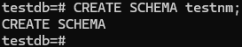
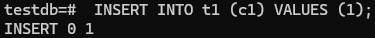

# Домашнее задание
## Работа с базами данных, пользователями и правами

### Цель:
- создание новой базы данных, схемы и таблицы
- создание роли для чтения данных из созданной схемы созданной базы данных
- создание роли для чтения и записи из созданной схемы созданной базы данных

## Описание/Пошаговая инструкция выполнения домашнего задания:
- создайте новый кластер PostgresSQL 14
    > создаю новый кластер и запускаю его
    ```bash 
    sudo -u postgres pg_createcluster 14 main2
    sudo -u postgres pg_ctlcluster 14 main2 start
    ```
      
- зайдите в созданный кластер под пользователем postgres
    > захожу в созданный кластер
    ```bash 
    sudo -u postgres psql -p 5435
    ```
    
- создайте новую базу данных testdb
    > создаю новую базу данных с именем *testdb*
    ```sql
    CREATE DATABASE testdb;
    ```
    
- зайдите в созданную базу данных под пользователем postgres
    > подключаюсь к базе данных *testdb*
    ```sql
    \c testdb
    ```
    
- создайте новую схему testnm
    > сщздаю схему *testnm*
    ```sql
    CREATE SCHEMA testnm;
    ```
    
- создайте новую таблицу t1 с одной колонкой c1 типа integer
    > создаю таблицу
    ```sql
    CREATE TABLE t1 (c1 INTEGER);
    ```
    
- вставьте строку со значением c1=1
    > вставляю строку
    ```sql
    INSERT INTO t1 (c1) VALUES (1);
    ```
   
- создайте новую роль readonly
    > создаю роль *readonly*
    ```sql
    CREATE ROLE readonly;
    ```
    
- дайте новой роли право на подключение к базе данных testdb
    > добавляю для роли readonly право на подключение к базе данных testdb
    ```sql
    GRANT CONNECT ON DATABASE testdb TO readonly;
    ```
    
- дайте новой роли право на использование схемы testnm
    > добавляю для роли readonly право на использование схемы testnm
    ```sql
    GRANT USAGE ON SCHEMA testnm TO readonly;
    ```
    
- дайте новой роли право на select для всех таблиц схемы testnm
    > добавляю для роли readonly право select для всех таблиц схемы testnm
    ```sql
    GRANT SELECT ON ALL TABLES IN SCHEMA testnm TO readonly;
    ```
    
- создайте пользователя testread с паролем test123
    > создаю пользователя *testread* с паролем test123
    ```sql
    CREATE USER testread  PASSWORD 'test123';
    ```
    
- дайте роль readonly пользователю testread
    > добавляю для пользоватедя *testread* роль readonly
    ```sql
    GRANT readonly TO testread;
    ```
    
- зайдите под пользователем testread в базу данных testdb
    > в втором терминальном окне подключаемся к базе данных testdb под пользователем testread 
    ```sql
    psql -h localhost -p 5435 -U testread -d testdb -W
    ```
    > ввожу пароль test123 \
    
- сделайте select * from t1;
    > выполняю запрос
    ```sql
    SELECT * FROM t1;
    ```
      
- получилось? (могло если вы делали сами не по шпаргалке и не упустили один существенный момент про который позже)
    > нет. отказано в доступе
- напишите что именно произошло в тексте домашнего задания
    > пользователь *testread* не имеет доступа к схеме *public*
- у вас есть идеи почему? ведь права то дали?
    > пользователю *testread* дали доступ к схеме *testnm* но не дали доступа к схеме *public*
- посмотрите на список таблиц
    > смотрю список таблиц
    ```sql
    \dt
    ```
    
- подсказка в шпаргалке под пунктом 20
    > смотрю шпаргалку : "20 таблица создана в схеме public а не testnm и прав на public для роли readonly не давали" 
- а почему так получилось с таблицей (если делали сами и без шпаргалки то может у вас все нормально)
    > проверим *search_path*
    ```sql
    SHOW search_path;
    ```
    
- вернитесь в базу данных testdb под пользователем postgres
    > в первом окне захожу пользователем *postgres* в базу *testdb*
    ```bash
    psql -u postgres -p 5435 -d testdb
    \c testdb
    ```
    
- удалите таблицу t1
    > удаляю таблицу *t1*
    ```sql
    DROP TABLE t1;
    ```
    
- создайте ее заново но уже с явным указанием имени схемы testnm
    > создаю таблицу в схеме *testnm*
    ```sql
    CREATE TABLE testnm.t1(c1 integer);
    ```
    
- вставьте строку со значением c1=1
> вставляю строку
    ```sql
    INSERT INTO testnm.t1 (c1) VALUES (1);
    ```
    
- зайдите под пользователем testread в базу данных testdb
    > во втором окне захожу в базу данных *testdb* под пользователем *testread*
    ```sql
    psql -h localhost -p 5435 -U testread -d testdb -W
    ```
- сделайте select * from testnm.t1;
    > выполняю запрос 
    ```sql
    select * from testnm.t1;
    ```
    
- получилось?
    > нет
- есть идеи почему? если нет - смотрите шпаргалку
    > для вновь созданных таблиц не назначаются права доступа и их нужно задать заново
- как сделать так чтобы такое больше не повторялось? если нет идей - смотрите шпаргалку
    > задать параметры доступа по умолчанию для схемы и заново назначить права для таблиц 
    ```sql
    ALTER DEFAULT PRIVILEGES IN SCHEMA testnm GRANT SELECT ON TABLES TO readonly;
    GRANT SELECT ON ALL TABLES IN SCHEMA testnm TO readonly;
    ```
    
- сделайте select * from testnm.t1;
    > выполняю запрос во втором окне под пользоавателем  *testread*
    ```sql
    select * from testnm.t1;
    ```
    
- получилось?
    > да. т.к. заново назначили права на новые таблиц в схеме
- есть идеи почему? если нет - смотрите шпаргалку
- сделайте select * from testnm.t1;
- получилось?
- ура!
- теперь попробуйте выполнить команду create table t2(c1 integer); insert into t2 values (2);
    > выполняю запросы
    ```sql
    CREATE TABLE t2(c1 integer);
    INSERT INTO t2 VALUES (2);
    ```
    
- а как так? нам же никто прав на создание таблиц и insert в них под ролью readonly?
    > по умолчанию search_path настроен на схему *public*, база данных создалась в схеме *public*, пользователь *testread* имеет права на создание объектов в базе данных в схеме *public* т.к. у него есть роль *public*.
- есть идеи как убрать эти права? если нет - смотрите шпаргалку
    > воспользуюсь шпаргалкой. отзываю права у роли *public* на создание объектов в схеме *public* и выполнение любых действий в базе данных *testdb*
    ```sql
    REVOKE CREATE ON SCHEMA public FROM public;
    REVOKE ALL on DATABASE testdb FROM public;    
    ```
- если вы справились сами то расскажите что сделали и почему, если смотрели шпаргалку - объясните что сделали и почему выполнив указанные в ней команды
    > отзыв прав у пользователя *testread* не ограничил права полученные через роль *public*
    ```sql 
    REVOKE CREATE ON SCHEMA public FROM testread; -- не оргиничивает права
    ```
- теперь попробуйте выполнить команду create table t3(c1 integer); insert into t2 values (2);
    > выполняю команды
    ```sql
    CREATE TABLE testnm.t3(c1 integer);
    INSERT INTO testnm.t2 VALUES (2);
    ```
    
- расскажите что получилось и почему
    > создать таблицу и добавить строку не получилось из за ограничения прав доступа
